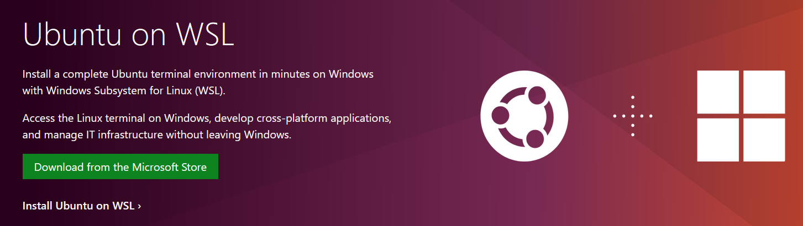
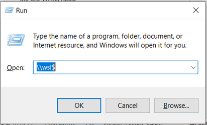
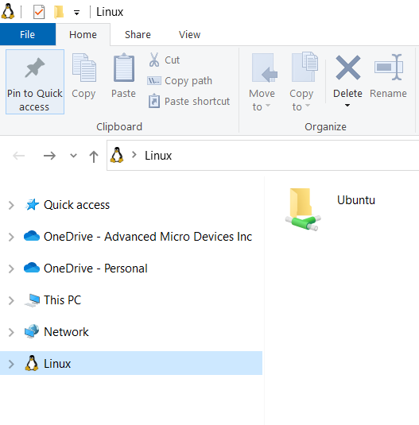
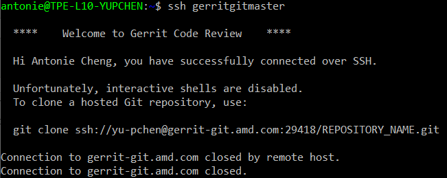

.. _getting_started:

Getting Started Guide
Install Ubuntu Terminal on Windows
**********************************

https://ubuntu.com/wsl

   
   Ubutntu WSL

Update OS and Install openssh
*****************************

.. code-block:: bash

   sudo apt update
   sudo apt upgrade
   sudo apt install git repo nano openssh-client

Gerrit SSH Setup
****************

Suppose you have set up Git and Repo on Cygwin before. Copy .ssh from cygwin to the Linux file system root directory:   

   
   Ubutntu WSL Path

   
   Ubutntu WSL Directory

Change File Permissions and test configuration

.. code-block:: bash

   chmod 0600 ~/.ssh/*
   ssh gerritgitmaster

   
   Test Configuration

If it still has permission problem, please try sudo command.

.. _install-required-tools:

.. rst-class:: numbered-step

Install Dependencies
********************

The current minimum required version for the main dependencies are:

.. list-table::
   :header-rows: 1

   * - Tool
     - Min. Version

   * - `CMake <https://cmake.org/>`_
     - 3.20.0

   * - `Python <https://www.python.org/>`_
     - 3.6

   * - `Devicetree compiler <https://www.devicetree.org/>`_
     - 1.4.6

   * - `Perl <https://www.perl.org/>`_
     - 5.34.0

#. Download, inspect and execute the Kitware archive script to add the Kitware APT repository to your sources list. 
   A detailed explanation of kitware-archive.sh can be found here kitware third-party apt repository:
   
   .. code-block:: bash

      wget https://apt.kitware.com/kitware-archive.sh
      sudo bash kitware-archive.sh

#. Use ``apt`` to install the required dependencies:
   
   .. code-block:: bash

      sudo apt install --no-install-recommends git cmake ninja-build gperf \
        ccache dfu-util device-tree-compiler wget \
        python3-dev python3-pip python3-setuptools python3-tk python3-wheel xz-utils file \
        make gcc gcc-multilib g++-multilib libsdl2-dev perl

#. Verify the versions of the main dependencies installed on your system by entering:

   .. code-block:: bash

      cmake --version
      python3 --version
      dtc --version
      perl --version

It is suggested to use Python virtual environment if you have other things to do with Ubuntu.

.. _install-west:

.. rst-class:: numbered-step

Install West
************

Python is used by the ``west`` meta-tool as well as by many scripts invoked by
the build system.

.. code-block:: bash

   pip3 install --user -U west
   echo 'export PATH=~/.local/bin:"$PATH"' >> ~/.bashrc
   source ~/.bashrc

Download and Install bzip2
**************************

.. code-block:: bash

   sudo apt install bzip2

Download and Install Zephyr SDK
*******************************

It should not have any warning or error message when you install SDK.

.. code-block:: bash

   cd ~
   wget https://github.com/zephyrproject-rtos/sdk-ng/releases/download/v0.13.2/zephyr-sdk-0.13.2-linux-x86_64-setup.run
   chmod +x zephyr-sdk-0.13.2-linux-x86_64-setup.run
   ./zephyr-sdk-0.13.2-linux-x86_64-setup.run -- -d ~/zephyr-sdk-0.13.2

.. note:: It should not have any warning or error message when you install SDK.

.. code-block:: none

   ZephyrEC
   ├── .west                   west configuration file
   ├── ecfwwork/modules        Zephyr RTOS modules includes EC SoC HAL    
   ├── ecfwwork/zephyr_fork    Snapshot from Zephyr RTOS             
   └── ecfw-zephyr             EC-FW application  

Export a Zephyr CMake Package
*****************************

This allows CMake to automatically load boilerplate code required for building Zephyr applications.

.. code-block:: bash

   cd ecfwwork/zephyr_fork    
   west zephyr-export

Zephyr's scripts/requirements.txt file declares additional Python dependencies. Install them with pip3.

.. code-block:: bash

   pip3 install --user -r ./ecfwwork/zephyr_fork/scripts/requirements.txt

Building and Flashing
*********************

Build EC FW by Select Options

   .. code-block:: bash
      choose your project boards
      for example if want to build nnpcx4mnx_mdsplum, please follow below options：
      cd ecfw-zephyr\boards\nuvoton\npcx4mnx_mdsplum   
      ./zephyrbuild.sh

   .. figure:: img/build-option.png
      :width: 600px
      :name: ec-select-option
   
      Select Option for MultiBoard

Flash EC-FW

After generating ec_external.bin and ec_internal.bin, base on EC run mode if we choose EC run external flash we choose ec_external.bin, prepare DediProg FlashEC_x81000.bat to flash this binary.

FlashEC_x81000.bat

   .. code-block:: bash

      @echo off
      set SPI_PATH="C:\Program Files (x86)\DediProg\SF Programmer"
      set SPI_TOOL=dpcmd.exe

      echo SPI TOOL: %SPI_PATH%\%SPI_TOOL%

      %SPI_PATH%\%SPI_TOOL% -u %1 --type W25Q256JW --addr 0x81000 -v

      pause