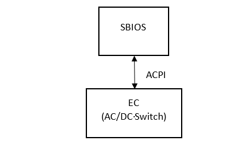
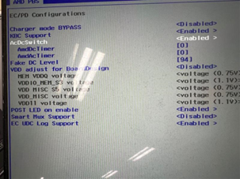
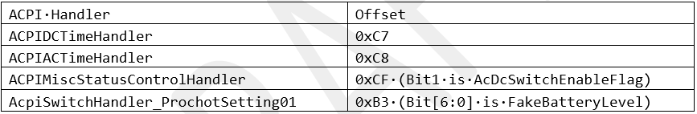
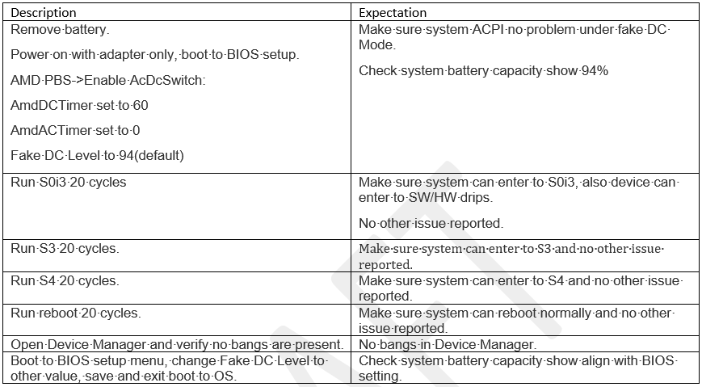

.. _acdcswitch:

AC/DC Switch
***************

User can use AC/DC switch to simulate a battery plug in. It is useful when users only plug in AC but want to validate some battery related feature.

Definitions
================================
- X86 - Main processors executing the x86 Instruction Set Architecture
- EC- Embedded Controller
- SBIOS - System Basic Input Output System
- ACPI - Advanced Configuration and Power Management Interface

Feature Execution Flow
================================
BIOS can send the AC/DC switch config to EC through ECRAM, and EC will report fake AC/DC status to BIOS.

AC/DC Switch Schematic

User can enable the feature in Device Manager -> AMD PBS -> EC/PD Configurations

BIOS Option

Feature Implementation Details
================================
If AC DC Switch is enabled by CMOS, then report battery always exist to OS.

.. code-block:: c

    g_ui8Virtual_ACDC_STATUS |= ACPI_BATTERY_CONNECTED;

    if ((g_bACDC_DCMode) && (!g_bACDC_ACMode)) {
        /**
         * DC mode --> AC Mode
         */
        if(g_ui8DC_Time_cnt) {
            g_ui8DC_Time_cnt --;
            if(g_ui8DC_Time_cnt) {
                return slpAllowed;
            }
            g_bACDC_DCMode = 0;
            g_bACDC_ACMode = 1;
            g_bACDC_ACEvent = 1;                    /* switch to AC mode */
            g_ui8AC_Time_cnt = AC_Time;
        }
        g_ui8DC_Time_cnt = DC_Time;
    } else if((g_bACDC_ACMode) && (!g_bACDC_DCMode)) {
        /**
         * AC mode --> DC mode
         */
        if(g_ui8AC_Time_cnt) {
            g_ui8AC_Time_cnt--;
            if(g_ui8AC_Time_cnt) {
                return slpAllowed;
            }
            g_bACDC_DCMode = 1;
            g_bACDC_ACMode = 0;
            g_bACDC_DCEvent = 1;                    // switch to DC mode
            g_ui8DC_Time_cnt = DC_Time;
        }
        g_ui8AC_Time_cnt = AC_Time;
    }

Both AC supply and battery are plugged in. 
AC time and DC time are not zero. 
Battery capacity > 10%. The switch will be between AC power and actual Battery. 
If battery capacity < 10%, EC will stop the switch, stay in AC mode, wait battery capacity over 20%, and start the switch again.

.. code-block:: c

    if(DC_Time && AC_Time && (ui32BatteryStatus & APP_SMTBTY_CONNECTED)) {
        g_LoadfakeBatteryData = 0;       /* use actual battery data */
        if(ui16BatteryPercentage <= 10) {
            g_ui8Virtual_ACDC_STATUS |= ACPI_AC_CONNECTED;
            return slpAllowed;
        } else if(ui16BatteryPercentage > 20) {
            if (g_bACDC_ACMode && g_bACDC_ACEvent) {
                g_ui8Virtual_ACDC_STATUS |= ACPI_AC_CONNECTED;
                gpio_write_pin(CHG_ACOK, 1);       /* Set AC_DC_SW to AC power */
                ACPI_NotifyHost(ACPI_SCI_AC);
                g_bACDC_ACEvent = 0;
            } else if (g_bACDC_DCMode && g_bACDC_DCEvent) {
                g_ui8Virtual_ACDC_STATUS |= ACPI_BATTERY_CONNECTED;
                g_ui8Virtual_ACDC_STATUS &= ~ACPI_AC_CONNECTED;
                gpio_write_pin(CHG_ACOK, 0);       /* Set AC_DC_SW to DC Power */
                ACPI_NotifyHost(ACPI_SCI_BATTERY);
                g_bACDC_DCEvent = 0;
            }
        }
    }

Only AC power supply exists. AC time and DC time are not zero. The switch will be between AC power and faked battery, and all use AC power.

.. code-block:: c

    else if(DC_Time && AC_Time && !(ui32BatteryStatus & APP_SMTBTY_CONNECTED)) {
        g_LoadfakeBatteryData = 1;             /* Load fake battery data */
        if(g_bACDC_ACMode && g_bACDC_ACEvent) {
            g_ui8Virtual_ACDC_STATUS |= ACPI_AC_CONNECTED;
            gpio_write_pin(CHG_ACOK, 1);            /* Set AC_DC_SW to AC power */
            ACPI_NotifyHost(ACPI_SCI_AC);
            g_bACDC_ACEvent = 0;
        } else if(g_bACDC_DCMode && g_bACDC_DCEvent) {
            g_ui8Virtual_ACDC_STATUS |= ACPI_BATTERY_CONNECTED;
            g_ui8Virtual_ACDC_STATUS &= ~ACPI_AC_CONNECTED;
            gpio_write_pin(CHG_ACOK, 0);            /* Set AC_DC_SW to DC Power */
            ACPI_NotifyHost(ACPI_SCI_BATTERY);
            g_bACDC_DCEvent = 0;
        }
    }

If AC time is set to zero, DC time is not zero; or DC set to MAX=255, EC always report DC mode with AC power. 
If AC and Battery all exist, EC report actual battery information; 
if only AC exists, EC report a faked battery, with 100% capacity.

.. code-block:: c

    else if (!AC_Time && DC_Time) {
        g_ui8Virtual_ACDC_STATUS |= ACPI_BATTERY_CONNECTED;
        g_ui8Virtual_ACDC_STATUS &= ~ACPI_AC_CONNECTED;

        if (!(ui32BatteryStatus & APP_SMTBTY_CONNECTED)) {
            g_LoadfakeBatteryData = 1;
        } else {
            g_LoadfakeBatteryData = 0;
        }
        gpio_write_pin(CHG_ACOK, 0);            /* Set AC_DC_SW to DC Power although there's no DC exists */
                                                /* On Gardenia/Jadeite, it was set to AC as we cannot simulate DC mode from HW layer */
        g_bACDC_DCEvent = 0;
        g_bACDC_ACEvent = 0;
    }

Firmware Domain Interactions
================================

ACPI Table

Firmware Interface
================================
EC to SBIOS interface for AC/DC Switch.

Feature Verification Environment
================================
AMD CRB board

Feature Verification Test Plan details 
================================
http://atm/atm/#/TestCases/2768660

Feature Verification Unit Test Plan
================================

Dependencies
================================
Need to plug in AC adapter. It's better not to plug in real battery when use AC/DC switch because 
it's mainly designed for internal user who don't own one real battery.