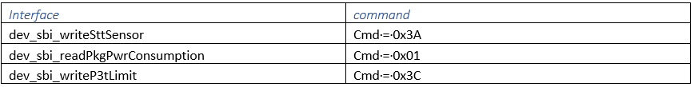
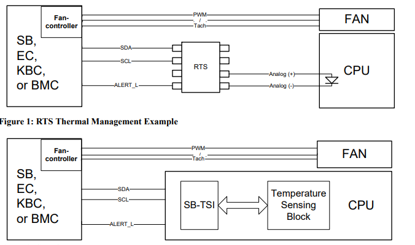
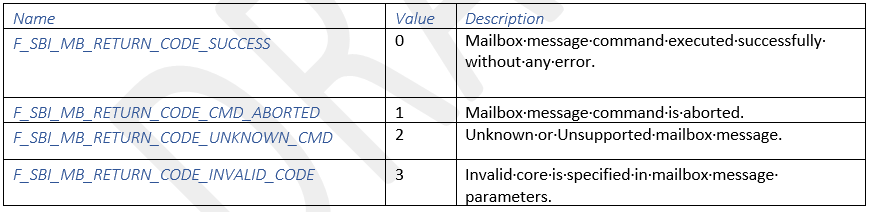

.. _apml:

Advanced Platform Management Link (APML)
***************

This document describes the APML firmware architecture for the system firmware feature. 
The document will provide a detailed description of the how the firmware architecture for APML will be implemented and verified. 
This document also describes the interaction between the APML and other firmware domains.
The Advanced Platform Management Link (SBI) is an SMBus v2.0 compatible 2-wire processor slave interface. 
APML is also referred as the sideband interface (SBI).

Definitions
================================
- ARA. Alert response address.
- EC. Embedded controller.
- KBC. Keyboard controller.
- lsb. Least significant bit.
- LSB. Least significant byte.
- msb. Most significant bit.
- MSB. Most significant byte.
- PEC. Packet error code.
- POR. Power on reset.
- RMI. Remote management interface.
- RTS. Remote temperature sensor
- SBI. Sideband interface.
- TSI. Temperature sensor interface.

Document Reference
================================
- System Management Bus (SMBus) specification. www.smbus.org.
- The I2C-Bus Specification. www.semiconductors.philips.com/products/interface_control/i2c/

Architecture
================================

The SBI follows protocol except:
1.	the processor does not implement SMbus master functionality.
2.	Only 7-bit SMbus addresses supported.
3.	The SBI implements the Send Byte/Receive Byte, Read/Write Byte, Block Read/Block Write and
Block write-Block Read Process Call SMbus protocols.

APML is used to communicate with the Remote Management Interface and the Temperature Sensor Interface.
The Setting of Current I2C Port is I2C_7 and the SBTSI_ADDRESS = 0x98.
There is a possibility that a device with a standard SMBus interface will not be able to directly interface to SBI. 
Therefore, Pass FETs must be used create two SMBus segment, see below Figure.

.. note::

   SCL&SDA pull-up resistors are the normal pull-up resistors for an SMbus segment, and are not part of the translation circuit. 
   They are shown for completeness.

Initial Feature Program
================================
Mandolin was the first program support this feature.

Feature Execution Flow
================================
1. The initiator (BMC) indicates that command is to be serviced by firmware by writing 0x80 to
   SBRMI::InBndMsg_inst7 (SBRMI_x3F). This register must be set to 0x80 after reset.
2. The initiator (BMC) writes the command to SBRMI::InBndMsg_inst0 (SBRMI_x38).
3. For write operations or read operations which require additional addressing information as shown in the table above, the initiator (BMC) writes Command Data In[31:0] to SBRMI::InBndMsg_inst[4:1]     {SBRMI_x3C(MSB):SBRMI_x39(LSB)}.
4. The initiator (BMC) writes 0x01 to SBRMI::SoftwareInterrupt to notify firmware to perform the requested read or write command.
5. Firmware reads the message and performs the defined action.
6. Firmware writes the original command to outbound message register SBRMI::OutBndMsg_inst0 (SBRMI_x30).
7. Firmware will write SBRMI::Status[SwAlertSts]=1 to generate an ALERT (if enabled) to initiator (BMC) to
   indicate completion of the requested command. Firmware must (if applicable) put the message data into the message registers SBRMI::OutBndMsg_inst[4:1] {SBRMI_x34(MSB):SBRMI_x31(LSB)}.
8. For a read operation, the initiator (BMC) reads the firmware response Command Data Out[31:0] from
   SBRMI::OutBndMsg_inst[4:1] {SBRMI_x34(MSB):SBRMI_x31(LSB)}.
9. Firmware clears the interrupt on SBRMI::SoftwareInterrupt.
10. BMC must write 1'b1 to SBRMI::Status[SwAlertSts] to clear the ALERT to initiator (BMC). It is recommended to clear the ALERT upon completion of the current mailbox command.

Feature Execution Flow
================================
The return of APML interface

Feature Verification Environment
================================
- Install Ruby 2.2.6 x64

   - https://rubyinstaller.org/downloads/

- Install AVTmain

   - n a common window please enter the following command: gem sources
   - If the response does not include http://rubygemserver.amd.com:9292/, type: gem sources --add http://rubygemserver.amd.com:9292
   - Then type: gem install apml
   - Start the script in verbose mode by typing: AVTmain -v

- Update AVTmain

   - Type: t

- Run Example

   - From the initial menu, select T (TSI). From the TSI menu, select B.  The script should progress through die numbers 0 .. 0xF.
   - The log will be in c:\AMD\logs\AVTmain_xxx.log, where xxx is a number.  Zero will not be listed.

Feature Verification Environment
================================

APML Normal Testing

- Start Syslog Daemon

   - Using the Windows start menu, start the Kiwi Syslog Daemon.
   - A new application window will open with the name Kiwi Syslog Service Manager.
   - You will see all logging messages appear in this window with the newest at the top.

- Start MPserver

   - Power on and start the SUT
   - Connect Hobbit on the SUT
   - Open a DOS window, then type c:\AMD\Kysy\
   - set PERL5LIB=c:\AMD\Kysy\Perl
   - perl MPserver.pl -w 10.237.91.217 (wombat's IP address)

- Open a Second DOS Window

   - cd c:\AMD\Kysy
   - then execute the APML tests.
   - Verbose log will be saved in c:\Program Files (x86)\Syslogd\logs\SyslogCatchAll.txt
   plan)

Internal Dependencies
================================
- APML in EC based on i2c_hub driver, EC as I2C Host role and follow APML protocol to complete one of a mailbox operation.
- APML used  Error Count (g_u32ApmlErrCnt), if dev_sbi_mb_service return error, this error will be recoded and if the accumulated error over APML_ERROR_NUM_THRESHOLD (500) the mailbox service will stop work, until APU reset then it can be recovery.

Risks
================================
Mail box service is not reenterable, so when we use it need add k_mutex_lock to make sure only one task operate service