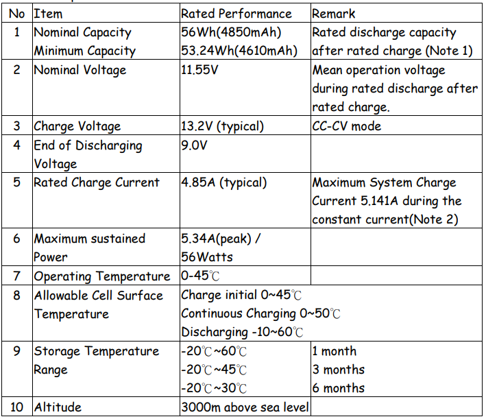
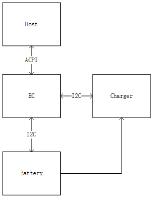
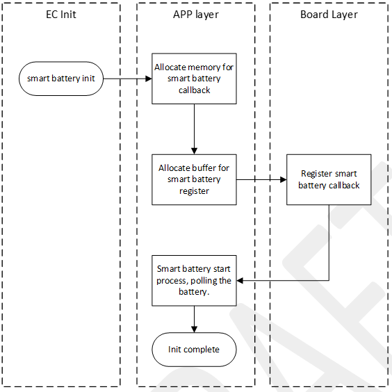
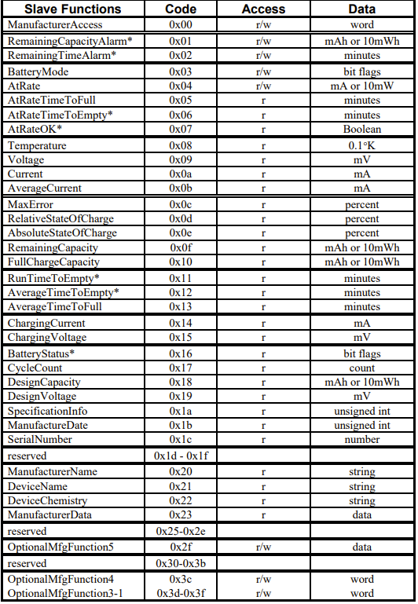
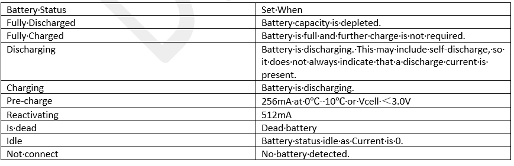
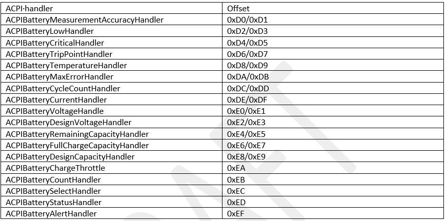
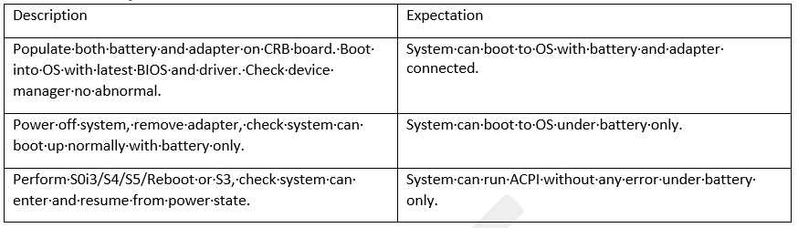

.. _battery:

Battery Device
***************

Smart battery presents an ideal solution for many of the issues related to batteries used in portable electronic equipment. 
The document will provide a description of the how the firmware architecture for smart battery management will be implemented in EC and how to verify it.
This document also describes the interaction between the EC smart battery management and other firmware domains.

Definitions
================================
- ACPI - Advanced Configuration and Power Interface
- APM - Advanced Power Management
- Battery - One or more cells that are designed to provide electrical power
- Cell - The cell is the smallest unit in a battery
- I²C-bus - A two-wire bus developed by Phillips, used to transport data between low-speed devices
- Smart Battery - A battery equipped with specialized hardware that provides present state, calculated and predicted information to its SMBus Host under software control.
- Smart Battery Charger - A battery charger that periodically communicates with a Smart Battery and alters its charging characteristics in response to information provided by the Smart Battery
- SMBus - System Management Bus
- SMBus Host - A piece of portable electronic equipment powered by a Smart Battery
- Packet Error Check - An additional byte in the SMBus protocols used to check for errors in an SMBus transmission.

Document Reference
================================
- Smart Battery Charger Specification Revision 1.1
- Smart Battery Data Specification, Revision 1.1

Feature Description
================================
Smart Battery presents an ideal solution for many of the issues related to batteries used in portable electronic equipment. 
Users have chance to know the battery is about to run out or how much operating time is left. 
Equipment powered by the battery can determine if the battery, in its present state, can supply adequate power for an additional load. 
In laptop, we use EC to management the smart battery. EC has ACPI handler to transfer the battery information. 
So, the Host can get that through ACPI. Below is a table battery information sample.

When battery detected, EC will refresh the battery data. Host can access the battery data by ACPI. Charger can also get battery information directly.

Feature Execution Flow
================================
EC initialize the smart battery structure and thread, trying to detect battery.

Feature Implementation Details
================================
Smart battery stores the information in own register. EC access can access the register by I2C. And the data will be refreshed in the thread cycle.

Battery management can calculate battery status by flags.

Firmware Interface
================================
Host can access ACPI EC RAM to get the battery information. Below is the battery table.

These sci code can notify host the battery status change immediately.

.. code-block:: c
 
   #define ACPI_SCI_BATTERY                  0x39  // Bty insertion/remove
   #define ACPI_SCI_BATTERY_TRIP_POINT       0x3E
   #define ACPI_SCI_BATTERY_NOTIFY           0x45  // Battery status notify (charge done, low, battery trap etc.)

Customer Impact
================================
Customers have their customized battery management.

Feature Risk
================================
Medium

Feature Verification Environment
================================
AMD CRB board with battery.

Feature Verification Test Plan details 
================================
http://atm/atm/#/TestCases/2789294

Feature Verification Unit Test Plan
================================

User can Use CMD to get the battery report. Make sure the information is same to real status. BIOS or EC may report incorrect information.

.. code-block:: bash
 
   powercfg /batteryreport /output "C:\battery_report.html

Dependencies
================================
AMD CRB board with battery.
Turn off AC/DC switch function.
