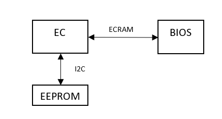
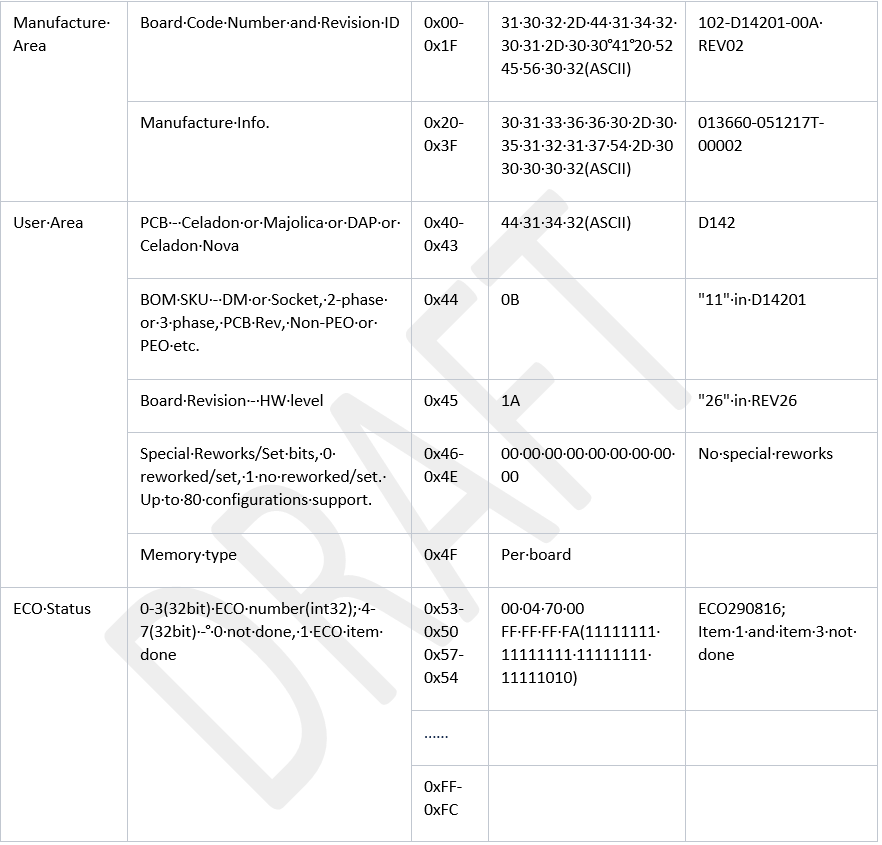
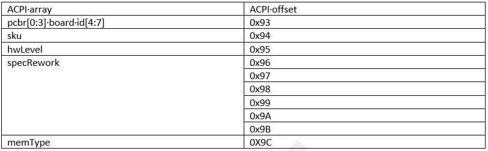

.. _boardid:

Board ID
***************

Board id can indicate PCB part number, serial number, memory type, etc. User can get board corresponding information they want from this feature. EC and BIOS can use this to distinguish board when programming.

Definitions
================================
- X86 - Main processors executing the x86 Instruction Set Architecture
- PSP - Platform Security Processor
- PSP FW - Security firmware executed by the PSP
- EC- Embedded Controller
- SBIOS - System Basic Input Output System
- EEPROM - Electrically-Erasable Programmable Read-Only Memory

Document Reference
================================

Feature Execution Flow
================================
- Factory flashed board id to EEPROM before leaving the factory.
- EC will R/W the EEPROM to get or flash board id table.
- BIOS can also get and flash board id through EC RAM.

BoardId Schematic

Feature Implementation Details
================================
I2C EEPROM data format.

E2PROM Format

ECRAM board id report format:

.. code-block:: c

   //         SKU(0x44) hwLevel(0x45)
   //         ||        ||
   //         vv        vv
   // 102-D27012-00A REV31
   //     ^  ^     ^
   //     |  |     |
   //  pcbName     pcbRev(0x4E [7:4])

The original data read from I2C EEPROM is stored in below struct. And it maps same as format in I2C EEPROM.

.. code-block:: c

   typedef union {
   uint8_t arr[BOARD_ID_BUF_SIZE];                // 256 bytes in use; 32 bytes reserved; so the structure can fully cover 6 pages
   struct {
      uint8_t pageBuf[BID_PAGE_LENGTH];
   } page[BID_MAX_PAGE_NUM];                      // 6 pages by each has 48 bytes.
   struct {
      uint8_t board[BID_MAX_BOARD_NAME_LENGTH];    // 0x00 - 0x1F
      uint8_t manfc[BID_MAX_MANFC_NAME_LENGTH];    // 0x20 - 0x3F
      uint8_t pcb[4];                              // 0x40 - 0x43 from ASKII Board[4 .. 7]
      uint8_t sku;                                 // 0x44        from Dec (Board[8 .. 9], MSB Board[8])
      uint8_t hwLevel;                             // 0x45        from Dec (Board[18 .. 19], MSB Board[18])
      uint8_t specRework[9];                       // 0x46 - 0x4E
      uint8_t memType;                             // 0x4F
      struct {
         uint32_t num;                              // [3 .. 0]    Display as ECO%06d
         uint8_t  flg[4];                           // [4 .. 7]    Display as %02X %02X %02X %02X
      } eco[BID_MAX_ECO_NUM];
      uint8_t rsvd[32];                            // rsvd[0 .. 4] holds contents of physical address 0x40 .. 0x44
   } f;
   } T_BOARD_ID_SPACE;

- Then EC will cover the original data to internal buffer, which is reported to host via ECRAM.
- The PCB revision and board id are converted to logic number. While SKU, hardware level and memory type are same as original value.
- Host can read below struct from ECRAM offset 0x93. (byte0 - 0x93, byte1 - 0x94 .....)

.. code-block:: c

   typedef union {
   uint8_t arr[BOARD_ID_EXPORTED_FIELD_LENGTH];
   struct {
      uint8_t pcbr  : 4; // byte0: pcb revision, 0 - '00A', 1 - '00B', 2 - '00C' ...
      uint8_t bid   : 4; // byte0: board id
      uint8_t sku;       // byte1:
      uint8_t hwLevel;   // byte2:
      uint8_t specRework[BOARD_ID_EXPORTED_FIELD_LENGTH - 4]; // byte3-8
      uint8_t memType;   // byte9: memory id
   } f;
   } T_BOARD_ID_EXPORTED_FIELD;

Firmware Domain Interactions
================================

ACPI Table

Firmware Interface
================================
EC to SBIOS interface for board id.

Feature Risk
================================
System can't boot up or hang when EC or BIOS didn't read correct board id.
Some board flashed incorrect board id can't boot up.

Feature Verification Environment
================================
AMD CRB board

Feature Verification Test Plan details 
================================
http://atm/atm/#/TestCases/2789420

Feature Verification Unit Test Plan
================================
Before check board ID info, please get the correct info from Board design team. Board ID of a project is consistent.
Boot to UEFI shell, run AMDBRDID_v0.4.efi, check Manufacture Area/User Area/Memory type/ECO Status, make sure all info can show correct. 
   ``\\valfs\swqa\Tools\AMDBRDID\AMDBRDID_v0.4.efi``

Dependencies
================================
Board should have EEPROM to store board id. Make sure it has been flashed right board id.