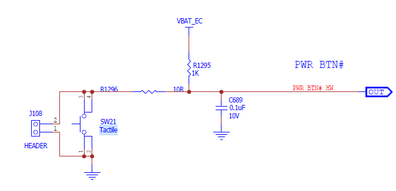
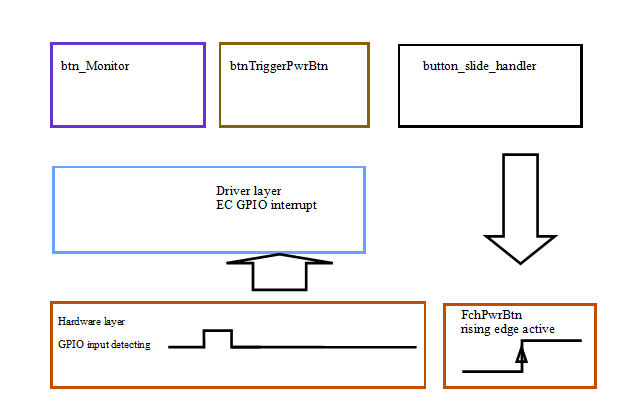
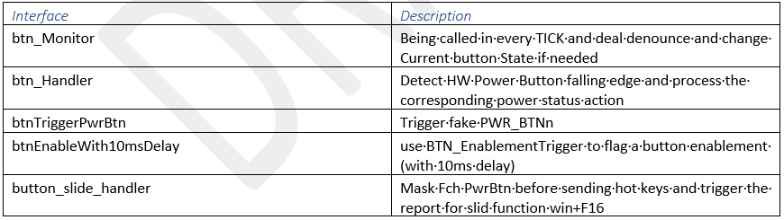
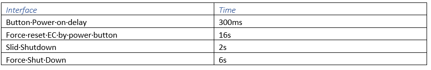
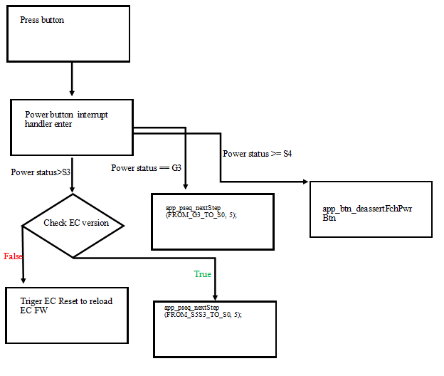
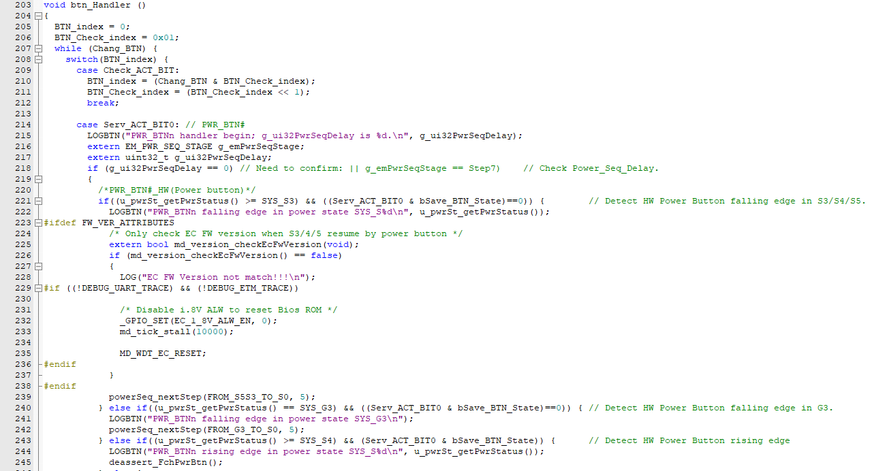

.. _button:

Button
***************
The computer shutdown button is a power button used to turn on or off the computer. 
The physical power button generally has functions such as power on, sleep, and forced shutdown. 
Normally, the physical button is not used to shut down the computer, as it is a forced shutdown method and is suitable power on, 
sleep, and forced shutdown for situations where the computer is stuck and cannot be shut down using the virtual button. 
When the computer is turned on, press and hold the power button for 2 seconds to shut it down.

From EC side, power button is just one of the normal GPIO, EC will detect the pin status, 
if power button GPIO input data register is from high to low then EC will be triggered an external interrupt. 
In this interrupt handle to deal related power button functions (power on, sleep, and forced shutdown).

Definitions
================================
- x86 - Main processors executing the x86 Instruction Set Architecture
- OS - Operating System

Document Reference
================================
- http://atm/atm/#/TestCases/3086743

Architecture
================================

Feature Description
================================

Timing of power button

Initial Feature Program
================================
Mandolin was the first Program support this feature.

Feature Execution Flow
================================

Feature Verification Environment
================================
window 11 please run register and disable VBS before run RW

Feature Verification Test Plan details 
================================
1. Flash BIOS on CRB board, install OS and SW stack.

2. For window 11 please run register and disable VBS before run RW.

    - RW: \\valfs\swqa\Tools\RW\
    - HKEY_LOCAL_MACHINE\SYSTEM\CurrentControlSet\Control\CI\Config, change     VulnerableDriverBlocklistEnable set as 0. or run \\valfs\swqa\Tools\RW\RWreg.regOr install RW and run reg with Toolbox:\\valfs\Public\FCH\Tools\, copy and run ToolBox_setup.exe, select "RW x64 1.7" and "RW Reg for Win11", then start to install.

3. Disable Core isolation and reboot
   Search "Core isolation" in Win start menu, change "Memory integrity" to off to disable core isolation , then reboot. 

4. Launch RW, select Embedded Controller Access
 
   - Click EC_SC/EC_DATA and set EC_SC = 0666, EC_DATA = 0662,then click OK.
   - Double check 0xB7, set Bit 0 = 1 then done.

5. Press Power button 2S, system will pop-up a menu to let system shutdown.
 
 .. figure:: slide_shutdown.png
   :width: 400px
   :name: slide_shutdown

6. Perform S3/S4/S0i3, then check slide shutdown menu pop-up.

Internal Dependencies
================================
Button pressing is one of the most important events for power sequence, ALW_EN, VDD_MISC_ALW,1.8V 5V ALW, 
SYS_ALW_PG, and RSMRST are all dependent on power button pressed.

 .. figure:: button_pwrseq.png
   :width: 600px
   :name: button_pwrseq

External Dependencies
================================
In the OS these general functions such as power on, sleep, and forced shutdown are all dependent on Power button feature.

Risks
================================
Power button is just having one pin, but included many functions, like sleep forced shutdown, 
the timing and the debounce are possibility risk for power buttons EC code need to make sure they are precious enough to avoid issue caused by margins.