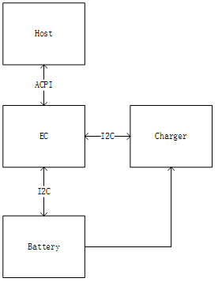
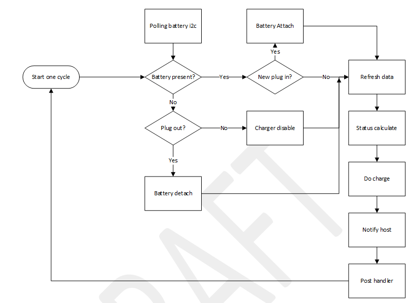
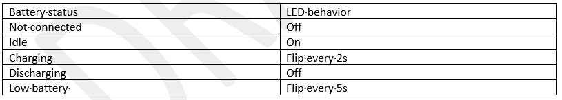
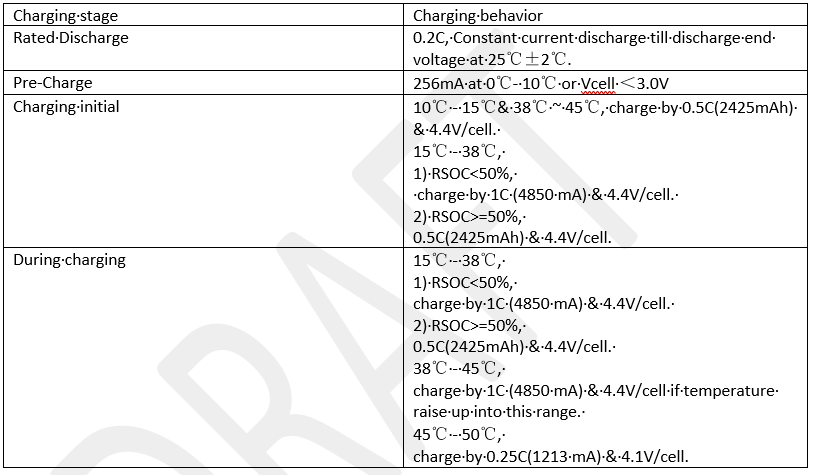
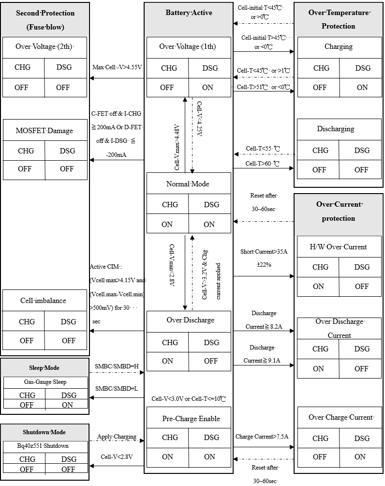
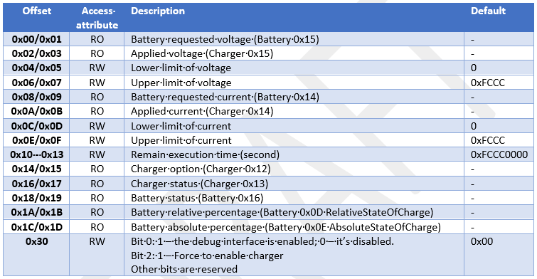
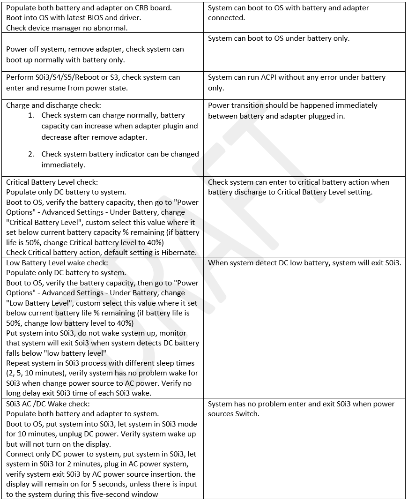

.. _chargecurve:

Battery device and charging curve
***************

When both of battery and charger attached, power system will enter charging status. 
Host can access EC to get status. This doc will introduce how the EC firmware deal 
with the charging status and the interface between EC, device and host.

Definitions
================================
-  ACPI - Advanced Configuration and Power Interface
-  APM - Advanced Power Management
-  Battery - One or more cells that are designed to provide electrical power
-  Cell - The cell is the smallest unit in a battery
-  I²C-bus - A two-wire bus developed by Phillips, used to transport data between low-speed devices
-  Smart Battery - A battery equipped with specialized hardware that provides present state, calculated and predicted information to its SMBus Host under software control.
-  Smart Battery Charger - A battery charger that periodically communicates with a Smart Battery and alters its charging characteristics in response to information provided by the Smart Battery
-  SMBus - System Management Bus
-  SMBus Host - A piece of portable electronic equipment powered by a Smart Battery
-  Packet Error Check - An additional byte in the SMBus protocols used to check for errors in an SMBus transmission.
-  RSOC - Relative State Of Charge

Document Reference
================================
-  Smart Battery Data Specification Revision 1.1(sbdat110)
-  Smart Battery Charger Specification Revision 1.1(sbc110)
-  isl9241-Rev.2.00
-  CC03056XL_SPEC_COS_20200518_VA
-  EC - Battery Device Mini FAD v1.0
-  EC - AC Device Mini FAD v1.0

Feature Description
================================
When both of battery and charger attached, power system will enter charge status. 
Host can access EC to get charge status. 
Each project may use different battery and charger. 
So different charging curve will be applied.

Feature Execution Flow
================================
Smart battery management runs in a loop thread.
When new battery attached, charger will apply charging voltage 
and current by charging policy and notify host to show the charging status. 
Debug information, DC prochot and P3tLimit will refresh in post handler. 
When unplug the battery, charger will be disabled, host shows unplug status.

BAT_LED can indicate the stage.

Charging voltage and current are related to battery characteristics, 
below is a recommended battery curve. It's highly correlated to charging stage, 
temperature and RSOC.

Except firmware will limit the voltage and current, 
battery will enter protect status when identify battery is abnormal. 
Below is CRB battery behavior.

Feature Implementation Details
================================
EC developer can modify the macro in project header to adapt different battery.

.. code-block:: c

   /*
   * Smart battery
   */
   #define APP_SMTBTY_DEBUG_ENABLE             (1)
   #define MAX_BATTERY_SUPPORTED               (1)
   #define APP_BATTERY_NO_BATT_CHARGE_VOLTAGE  (12000)   // If there is no battery adjust the charger output voltage to 12V
   #define APP_BATTERY_FULL_CHARGE_VOLTAGE     (13200)   /* 3-cell */
   #define APP_BATTERY_MIN_BATTERY_VOLTAGE     (10176)   /* [13:6] 0x27C0; 3.4V/cell */

   #define APP_BATTERY_REACTIVING_VOLTAGE      (13200)
   #define APP_BATTERY_REACTIVING_CURRENT      (256)

   #define APP_BATTERY_PRECHARGE_THRESHOLD     (0x30)
   #define APP_BATTERY_PRECHARGE_VOLTAGE       (13200)
   #define APP_BATTERY_PRECHARGE_CURRENT       (512)

   #define APP_BATTERY_MAX_CHARGE_CURRENT      (2428)    /* [12:2] 0x097C; 0.5C */
   #define APP_BATTERY_MAX_DISCHARGE_CURRENT   (5000)

Users use different charger adapter to use the system. As some adapter's power is low. 
The charging current should set lower than desire battery charging current.

.. code-block:: c

   uint16_t app_smtbty_chargeCurrentLimit (uint8_t u8BtyId)
   {  
      uint16_t chgCurLimit = 0;

      if (u8BtyId)
         return chgCurLimit;

      uint32_t inputCurLimit = app_pwrSrc_sysAcLimit();

      chgCurLimit = inputCurLimit;
      // limit the charge current judged by temperature
      if (chgCurLimit >= 4500)
      {
         uint32_t batTmpK;
         f_battery_i32Read(0, F_BAT_REG_Temperature, &batTmpK);
         int32_t batTmpC;
         batTmpC = batTmpK / 10 - 273;
         LOGBCT("Battery Temperature %d °C\n", batTmpC);
         if (batTmpC < 15) {
               chgCurLimit = F_BATTERY_MIN_CHARGE_CURRENT;
         } else if ((15 <= batTmpC) && (batTmpC < 20)) {
               chgCurLimit = F_BATTERY_MID_CHARGE_CURRENT;
         } else if ((20 <= batTmpC) && (batTmpC < 45)) {
               chgCurLimit = F_BATTERY_MAX_CHARGE_CURRENT;
         } else {
               chgCurLimit = F_BATTERY_MID_CHARGE_CURRENT;
         }
      /* If PD adapter capability below 90W use the 0.9A charge current */
      } else {
         chgCurLimit = F_BATTERY_MIN_CHARGE_CURRENT;
      }

      return chgCurLimit;
   }

Firmware Domain Interactions
================================
-  Host can access EC ACPI to get battery and charger status. 
   Please refer to EC - Battery Device, EC - AC Device for detailed ACPI interface.
-  Some users need smart battery debug handler. 
   Program ECRAMx31 with 0xBC before any operation to the interface. 
   EC RAM 0x00 to 0x30 are defined as below.

Firmware Interface
================================
-	ESPI ACPI interface between BIOS and EC. 
-	I2C between EC and charger.
-	I2C between EC and battery.

Feature Risk
================================
High

Feature Verification Environment
================================
AMD mobile platform with battery and charger

Feature Verification Test Plan details 
================================
http://atm/atm/#/TestCases/2789294

Feature Verification Unit Test Plan
================================

Dependencies
================================
- AMD mobile platform with battery and charger.
- Turn off AC/DC switch function.

