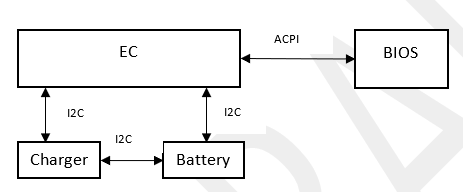
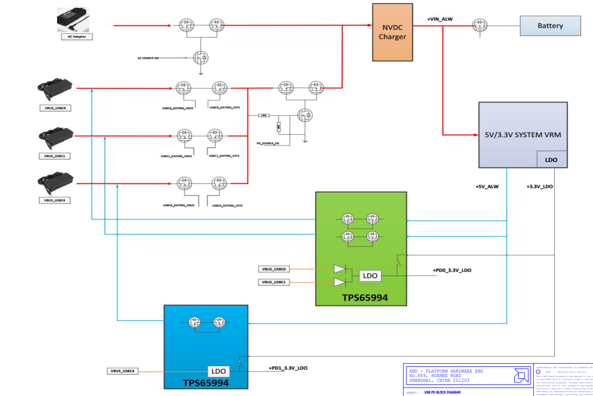
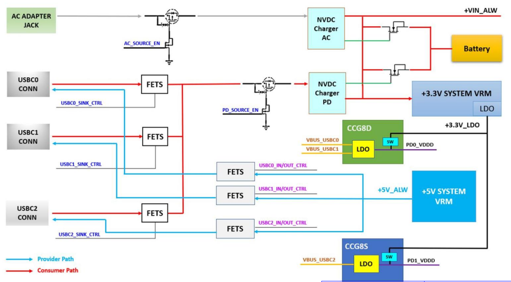
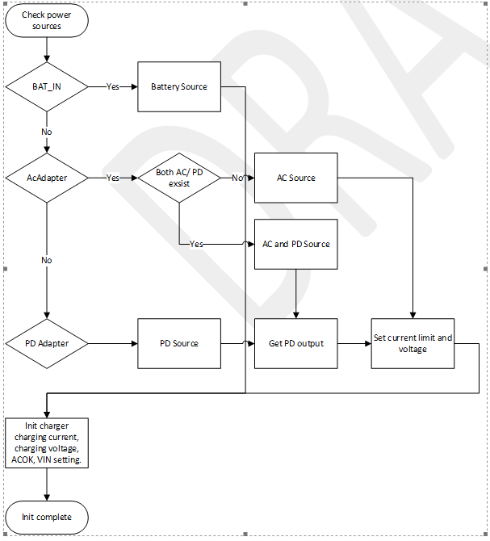
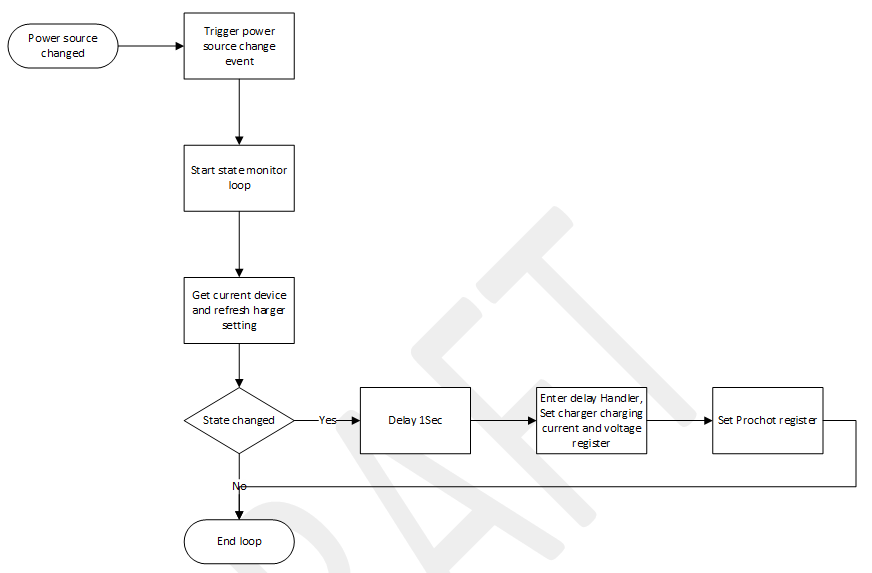
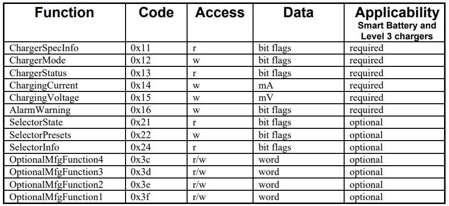
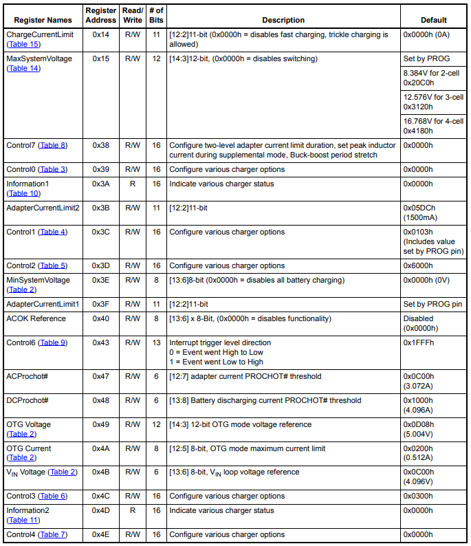
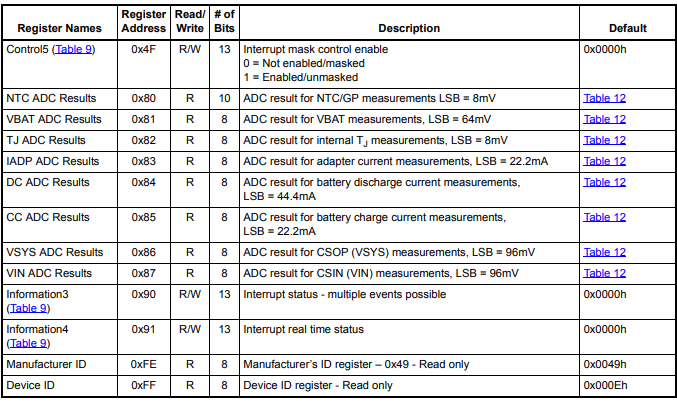
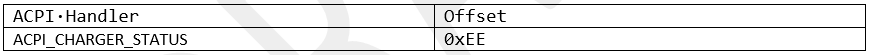
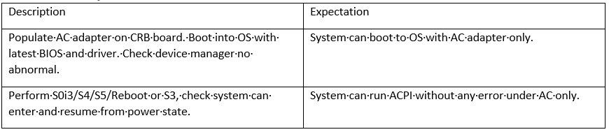

.. _acdevice:

AC Device
***************

The AC Device (Smart Battery Charger) presents one element of a complete system solution for rechargeable batteries used in laptop computer systems. 
Designed for use with batteries compliant with the Smart Battery Data Specification (refer to the References section), 
the electrical characteristics of the Smart Battery Charger feature charging characteristics that are controlled by the battery itself, in contrast to a charger with fixed charging characteristics that will work with only one cell type. 
The Smart Battery/Smart Battery Charger combination provides distinct advantages in system safety, performance and cost.

Definitions
================================
-  ACPI - Advanced Configuration and Power Interface
-  Battery - One or more cells that are designed to provide electrical power
-  Host Controller - An intelligent entity that communicates with a Smart Battery and a Smart Battery Charger, reading the battery's charge requirements and controlling the battery charger.
-  I²C-bus - A two-wire bus developed by Phillips, used to transport data between low-speed devices
-  Smart Battery - A battery equipped with specialized hardware that provides present state, calculated and predicted information to its SMBus Host under software control.
-  Smart Battery Charger - A battery charger that periodically communicates with a Smart Battery and alters its charging characteristics in response to information provided by the Smart Battery
-  SMBus - System Management Bus
-  SMBus Host - A piece of portable electronic equipment powered by a Smart Battery
-  Packet Error Check - An additional byte in the SMBus protocols used to check for errors in an SMBus transmission.

Document Reference
================================
- Smart Battery Charger Specification Revision 1.1
- Smart Battery Data Specification, Revision 1.1
- isl9241-Rev.2.00

Feature Execution Flow
================================
Charger is controlled by EC. And EC can report the charger status to host through ACPI.

AC Device Schematic

In single charger system, Only one power source(AC adapter or PD Adapter) can supply power to system.

Single Charger System

In Dual Charger System, AC and PD adapter can supply power at the same time.

Dual Charger System

When EC boot. Power on reset will be executed depend on current power source.

When power source changed. Power source thread will be triggered and change the charger setting.

Feature Implementation Details
================================
Most chargers have the following registers, which are defined in the Smart Battery Charger Specification Revision 1.1.

Different chargers have additional registers. The following are the registers of isl9241 used on CRB. 
They can provide extra functions like prochot, current limit, etc. Other chargers have similar registers.

EC will allocate memory space for charger register.

.. code-block:: c

 dev_charger_register_platform_table(CHGID, _s_FP7_isl9241_regs ,_s_platform_chgBufTable);

Initialization settings will be made for some registers of the charger.

.. code-block:: c

    dev_charger_i32Write(CHGID, DEV_CHARGER_REG_ChargerChargingVoltage, APP_BATTERY_FULL_CHARGE_VOLTAGE);
    dev_charger_regRMW(CHGID, DEV_ISL9241_REG_Control3, 0x0001, 0x0001); // enable charger all ADC, it may be disabled in DC only case

    /**
     * fixed charger settings
     */
    /* 01. Tracking charger current = 256mA or 3'b111 */
    dev_charger_regRMW(CHGID, DEV_ISL9241_REG_Control2, 0xE000, 0xE000);
    /* 02. Charger PROCHOT# related settings */
    /*     02.a Set AC/DC threshold */
    dev_charger_AdapterACProchotL(CHGID, g_sysAcLimit1 * 95 / 100);                   /* AC = AcLimit1 * 0.95 */
    dev_charger_AdapterDCProchotL(CHGID, APP_BATTERY_MAX_DISCHARGE_CURRENT * 95 / 100); /* DC = 5000mA * 0.95 */
    /*     02.b Set CHG_PROCHOT# parameters (default 7us debounce + 10ms duration)
     *          [10:9] = 2'b10  - 500us debounce
     *          [ 8:6] = 3'b100 - 1ms Duration
     */
    dev_charger_regRMW(CHGID, DEV_ISL9241_REG_Control2, 0x0500, 0x07C0);
    /*     02.c set Bit<4:3> 2'b11 12A (lowest) (RS2 = 5mO) for PSYS disabled case */
    dev_charger_regRMW(CHGID, DEV_ISL9241_REG_Control0, (0x03 << 3), (0x03 << 3)); 
    /*     02.d set PSYS = enabled so DEV_ISL9241_REG_DCProchotL taking effect */
    if (g_isThrottleApuInDcOnly) {
        dev_charger_regRMW(CHGID, DEV_ISL9241_REG_Control1, cbit(3), cbit(3)); 
    }

    /* 03. Enable SlewRateControl to ramp DAC voltage as per Tanner (2020/11/26) */
    dev_charger_regRMW(CHGID, DEV_ISL9241_REG_Control4, cbit(13), cbit(13));

    /* 04. Set the prochot callback */
    dev_charger_prochot_register(board_smtbty_setProchotGate);

EC will set some registers depend on the power source plug in during boot.

.. code-block:: c

    /* power on reset charger setting */
    board_pwrSrc_powerOnReset();

EC will monitor whether power source changed. If changed, will call the callback function and set the register again.

.. code-block:: c
 
    /* Power source state machine and monitor */
    board_pwrSrc_stateMonitor();

Firmware Domain Interactions
================================
Host can access ECRAM to get charger status.

When plug in AC adapter, EC will trigger SCI to notify host. So host can change the status immediately.

.. code-block:: c
 
   ACPI_NotifyHost(ACPI_SCI_AC);

Firmware Interface
================================
EC to SBIOS interface for AC device.

Feature Risk
================================
High

Feature Verification Environment
================================
AMD CRB board with AC adapter.

Feature Verification Test Plan details 
================================
http://atm/atm/#/TestCases/2789294

Feature Verification Unit Test Plan
================================

Dependencies
================================
AMD CRB board with AC adapter.
