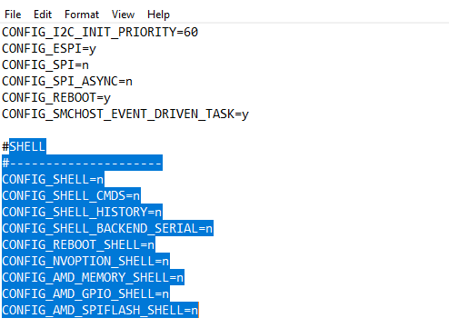
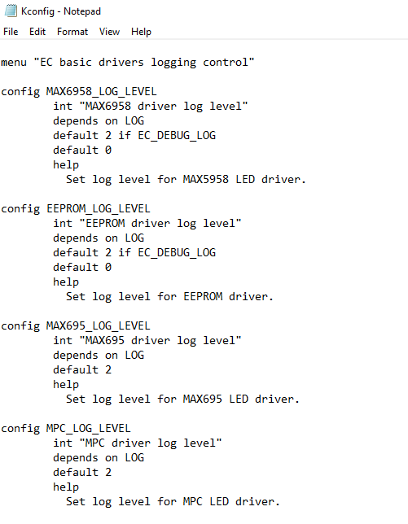
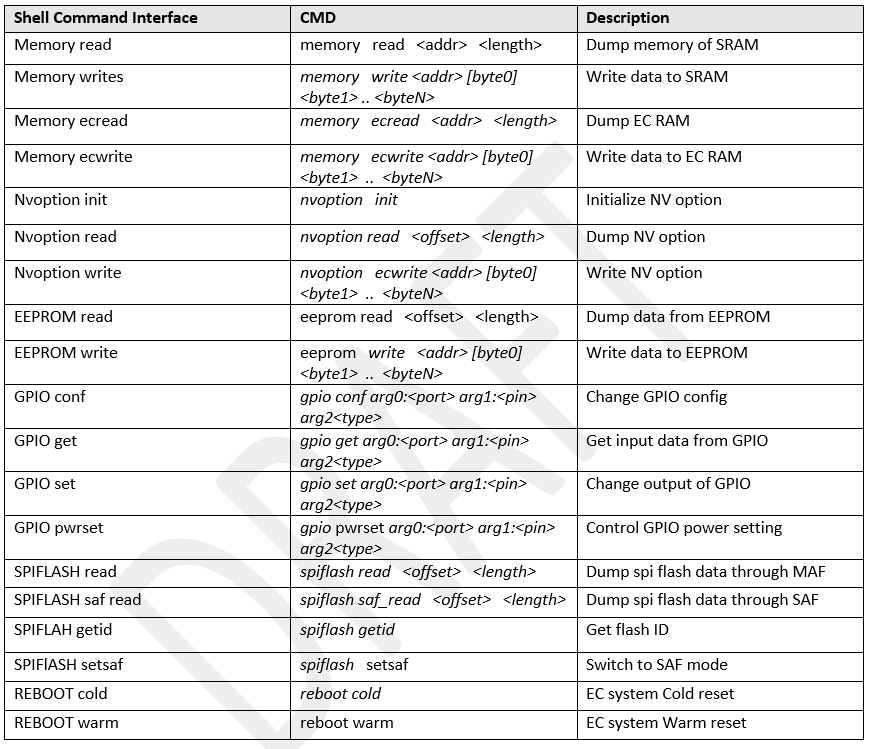
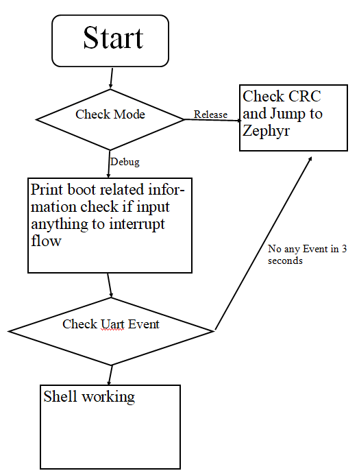
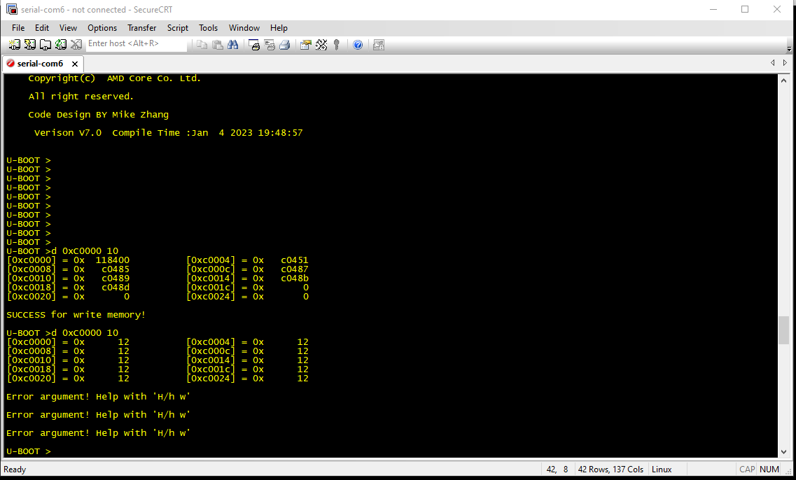
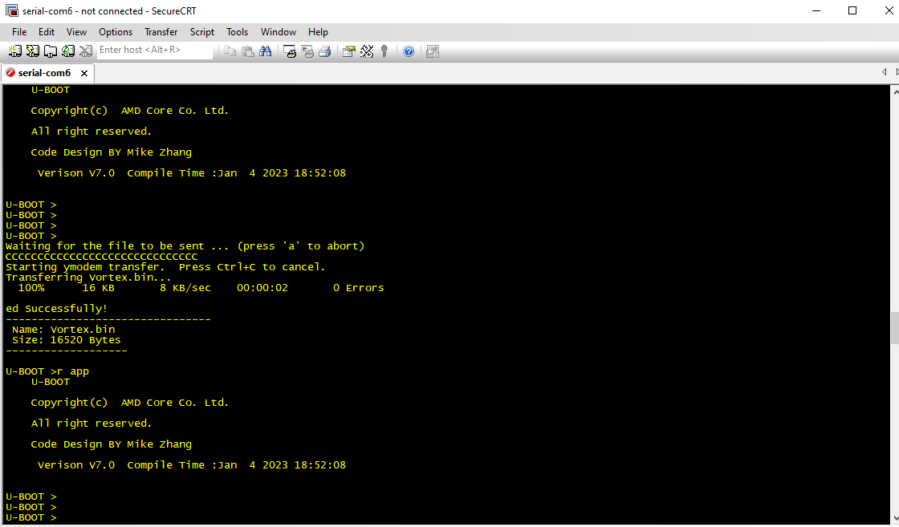

.. _ecdebug:

EC Debug
***************

This document describes the EC debug methodology, 
EC debug is based on Logs output from UART Tx or dump logs. 
if met timing issue we need to dump logs from memory. 
As formal EC the debug interfaces are all be disabled, 
this document is for the purpose of debug, and do some introduce how to debug.

Definitions
================================
- SOC - System On Chip

Features
================================
1. Enable Shell from config file

2. Log level control

3. Shell function

   Each module has its own log level (debug info warning and error), log will output from which level is depends on the setting in configuration.

4. Bootloader

- In debug processing, bootloader can as a critical role during bring up, if met hardware issue bootloader as the first then simple code can help diagnose the possible reason of failing based on its shell interface.
- Bootloader one of the codes which run before application, if UART detected Rx in 100ms after EC power on, bootloader will active, and it can how dump EC SRAM to check whether Memory is as expected and can reload EC FW by Y modern protocol tool.

Boot dump EC SRAM

Boot reloader EC FW and Jump to APP

