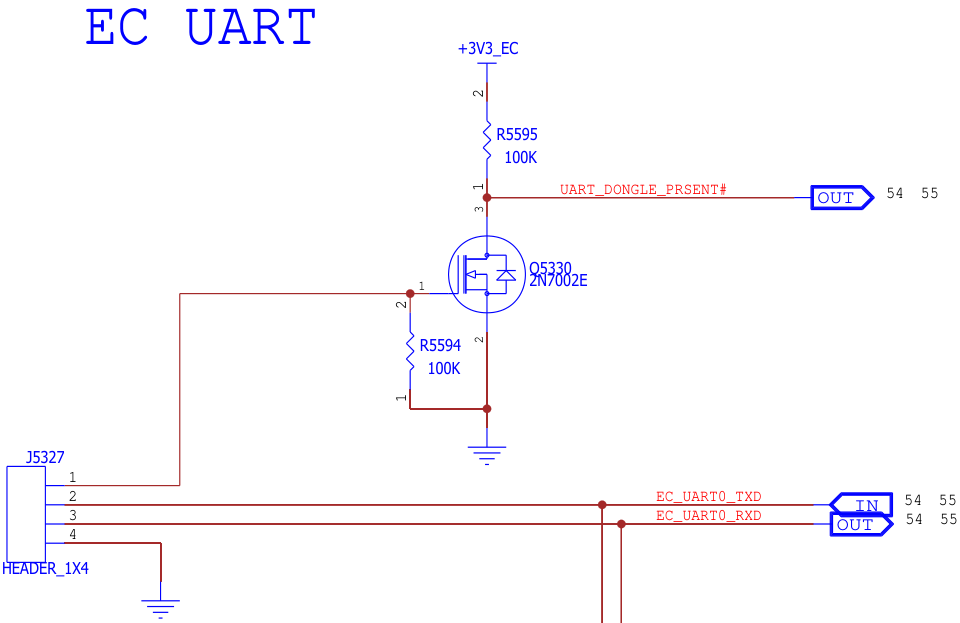
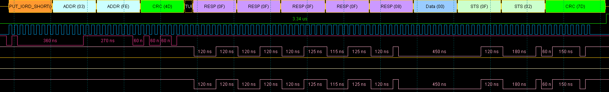
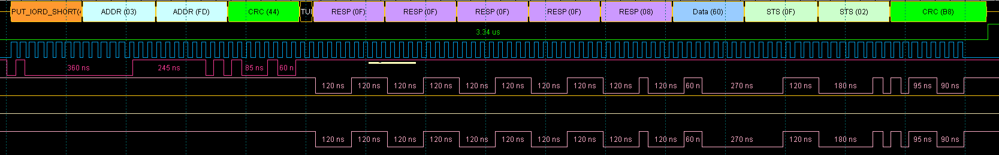
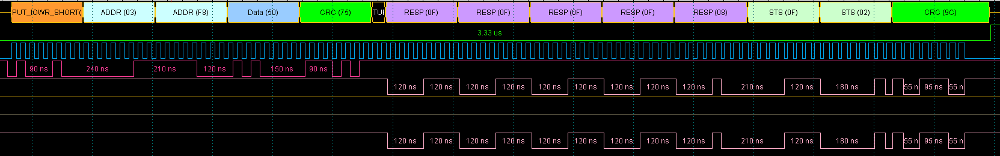
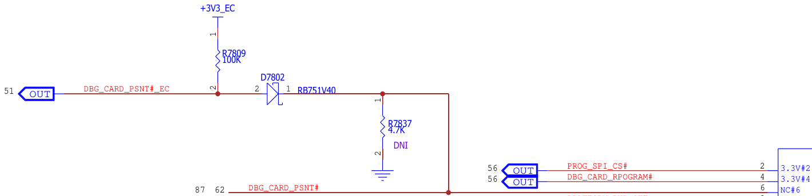
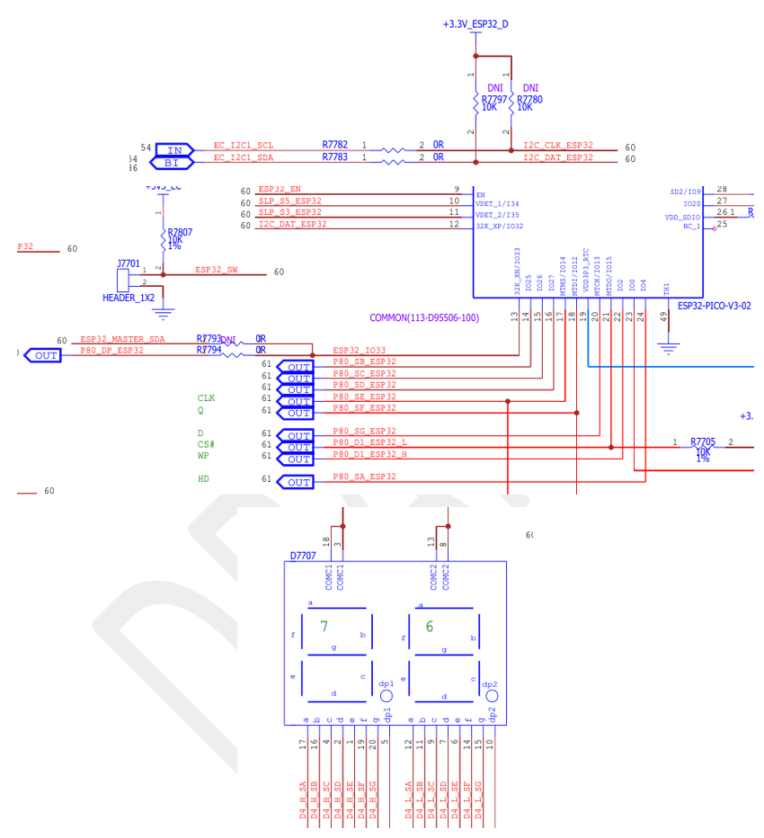
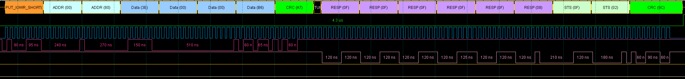
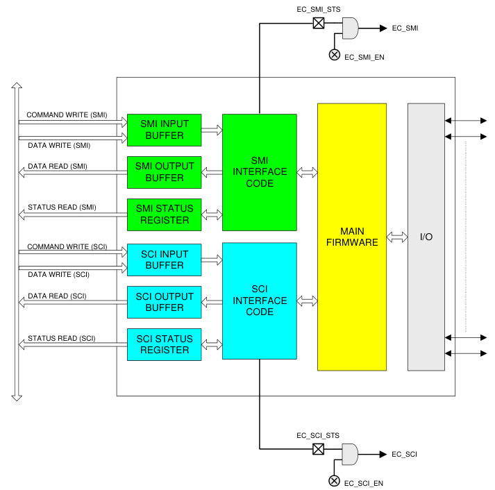
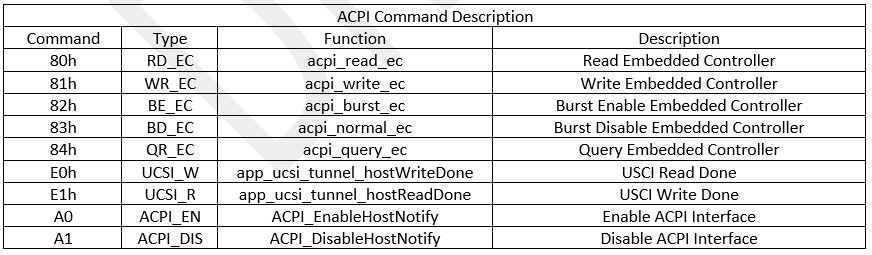
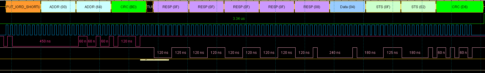

.. _espi:

Enhanced Serial Peripheral Interface (eSPI)
***************
This document describes the EC eSPI firmware architecture for the system firmware feature. 
A system firmware feature impacts multiple firmware domain. 
The document will provide a detailed description of the how the firmware architecture for feature will be implemented and verified. 
This document also describes the interaction between domains.

Definitions
================================
-  x86 - Main processors executing the x86 Instruction Set Architecture
-  PSP - Platform Security Processor
-  PSP FW - Security firmware executed by the PSP
-  FCH - Fusion Controller Hub
-  EC - Embedded Controller 
-  eSPI - Enhanced Serial Peripheral Interface
-  OOB - Out Of Band Channel Interface
-  MAFS - General and Controller-Attached
-  CAFS - General and Controller-Attached
-  SAFS - Target Attached Flash Sharing Interface
-  TAFS - Target Attached Flash Sharing Interface
-  BARs - Base Address Registers

Document Reference
================================
Add any references that will help to understand the content of this document.

   - eSPI_SAFS_Implementation_Spec.doc
   - ACPI_5_Errata_A.pdf
   - 327432 espi_base_specification R1-5.pdf
   - PSP_Enabled_EC_eSPI_Access_Design_Specification.pdf
   - EC - eSPI Diags test interface FAD v1.0

Features
================================
This section describes the design and architecture of the features. 
The eSPI interface is used by the System Host to configure the chip and communicate with the logical devices implemented in the design through a series of read/write function registers.
 
The eSPI interface consists of four channels:

   - eSPI Peripheral Channel Interface
   - eSPI Out Of Band Channel Interface
 
   - eSPI Flash channel Interface: 

      1.	General and Controller-Attached
      2.	Target Attached Flash Sharing Interface
 
   - eSPI Virtual Wires Channel

There four channels are multiplexed onto the eSPI physical interface that connects the Embedded Controller device with the Host Chipset. Figure 0-1 below illustrates this multiplexing:

   .. figure:: eSPI_multiplexing_block_diagram.png
      :width: 600px
      :name: eSPI_multiplexing_block_diagram

      Figure 0-1 eSPI multiplexing block diagram.
   
eSPI Peripheral Channel
***************

Introduction
================================
The Enhanced SPI (eSPI) Interface is used by the System Host to configure the chip and communicate with the logical devices implemented in the design through a series of read/write registers.

The Base Address Registers allow any logical device’s runtime registers to be relocated in eSPI I/O space. All chip configuration register for the device is accessed indirectly through the eSPI I/O Configuration Port.

Many Logical Devices may also be assessed via Host Memory cycles, instead of I/O cycles.

In addition to Host access of EC resources over the eSPI Peripheral Channel Interface, the interface also enables the EC to access Host memory through the Bus Master facility.

I/O Space Base Address Registers (BARS)
================================
In the EC system If the host enable the peripheral channel, EC will configures the following sub-device BARs before EC report the peripheral channel ready signal to the Host.

+--------------------+----------------------------+---------------------------+---------------------------------+
| I/O Device         | Init Function              | Host Address              | Feature                         |
+====================+============================+===========================+=================================+
| INI_MBOX           | espi_xec_set_udc_port      | 0x0036/0x03FC             | UDC Universal Card PRESENT      |
+--------------------+----------------------------+---------------------------+---------------------------------+
| INIT_KBC0          | init_kbc0                  | 0x0060                    |  KEYBOARD                       |
+--------------------+----------------------------+---------------------------+---------------------------------+
| INIT_ACPI_EC0      | init_apci_ec0              | 0x0662                    |  EC_RAM / Q-Event               |
+--------------------+----------------------------+---------------------------+---------------------------------+
| INIT_ACPI_EC1      | init_apci_ec1              | 0x0668                    |  Customized CMD                 |
+--------------------+----------------------------+---------------------------+---------------------------------+
| INIT_ACPI_EC4      | espi_xec_set_udc_port      | 0x03F8                    |  UDC Universal Card PRESENT     |
+--------------------+----------------------------+---------------------------+---------------------------------+
| INIT_SRAM0         | init_sram0                 | 0xFEEC2000                |  MMIO                           |
+--------------------+----------------------------+---------------------------+---------------------------------+
| INIT_P80BD0        | init_p80bd0                | 0x0080                    |  POSTCODE                       |
+--------------------+----------------------------+---------------------------+---------------------------------+
| INIT_UART0         | espi_xec_set_udc_port      | 0x03F8                    | UDC UART DONGLE PRESENT         |
+--------------------+----------------------------+---------------------------+---------------------------------+

Software should ensure that no two BARs map the same eSPI I/O address. If two BARs do map to the same address. Then when an eSPI access is targeting the address with the BARs conflict, the BARs at the lowest internal address will be chosen.

+----------+------------------+-------+---------------------------------+
| Name     | Interrupt source | Value |Feature                          |
+==========+==================+=======+=================================+
| 8042     | KIRQ             | 1     |     Keyboard                    |
+----------+------------------+-------+---------------------------------+
| 8042     | MIRQ             | 12    |     Keyboard                    |
+----------+------------------+-------+---------------------------------+
| UART     | UART             | 4     |  UDC UART DONGLE PRESENT        |
+----------+------------------+-------+---------------------------------+
All enabled interrupt sources must be assigned a unique IRQ value in their registers. That is, IRQ numbers cannot be shared, and if two sources are assigned the same value, unpredictable results may occur. The value FFh, since it is the Disable encoding, is the only value that is allowed to appear in multiple registers.

The steps of config the eSPI I/O Component (Configuration Port) in code level.

- eSPI Peripheral Channel interrupt:

.. code-block:: c

   static void espi_pc_isr (const struct device *dev)

- Detect the Host enable target’s Peripheral Channel:

.. code-block:: c

   setup_espi_io_config (dev, MCHP_ESPI_IOBAR_INIT_DFLT);

- Config the I/O Component BARs and IRQ number assigned:

.. code-block:: c

   config_sub_devices(dev);
   xec_host_dev_init(dev);
   configure_sirq(dev);

- Or config the optional BARs in the UDC thread:

.. code-block:: c

   espihub_set_udc_port (espi_udc_status status)
   espi_xec_set_udc_port (espi_dev, status);

UDC UART DONGLE PRESENT - UART0 (I/O Component + VW IRQ)
================================
The EC system detects the signal of pin UART_DONGLE_PRSENT# to determine the UDC_UART_DONGLE_PRESENT status. 
If the board is in udc_uart_dongle_present case, EC will enable EC UART0 at COM1 and IRQ 4. 
The code interface is espihub_set_udc_port (ESPI_UDC_UARTDONGLE_PRESENT); 
and the handle code segment is as following:

.. code-block:: c

   case ESPI_UDC_UARTDONGLE_PRESENT:
      ESPI_IOM_REGS->IOHBAR[IOB_MBOX] = MCHP_ESPI_MBOX_BAR_ADDRESS;
      ESPI_IOM_REGS->IOHBAR[IOB_ACPI_EC4] = MCHP_ESPI_ACPI_EC4_DUMMY_BAR_ADDRESS;
      ESPI_IOM_REGS->IOHBAR[IOB_UART0] = MCHP_ESPI_UART0_BAR_ADDRESS | MCHP_ESPI_IO_BAR_HOST_VALID;
      ESPI_IOM_REGS->SIRQ[SIRQ_UART0] = MCHP_UART_IRQ;

   Figure 1-18 UDC UART dongle present board design.

The setting of the UART0 BARs address is 0x03f8 and the UART HW controller function is as following table. 
The registers listed in the Runtime Register Summary table are for a single instance of the UART. 
Host access for each register listed in this table is defined as an offset in the Host address space to the Block's Base Address, as defined by the instance's Base Address Register.
The table 1-20 only illustrates the register of UART that host access it in the runtime case. 
The detail of the bits field seen in the chip's datasheet.

+------------------+-------------------------+-------------------------------------------+
| Host I/O address | register name           | Bits field                                |
+==================+=========================+===========================================+
| 03F8h            | Receive Buffer Register | Received data                             |
+------------------+-------------------------+-------------------------------------------+
| 03FDh            | Line Status Register    | bit0: Data ready, bit[7,1]: Error fields  |
+------------------+-------------------------+-------------------------------------------+
| 03FEh            | Modern Status Register  | See AMD PPR                               | 
+------------------+-------------------------+-------------------------------------------+

The following figures issue the sequence of the host access the EC UART controller through the eSPI peripheral channel with I/O access methods.

   Figure 1-21 Host read the UART controller's Modem Status Register to confirm the serial port is ready.

   Figure 1-22 Host read the UART controller's Line Status Register to confirm the UART if it's in the tx mode or if the received buffer is ready to accept a new char.

   Figure 1-23 Host write a data into the UART controller's Receive Buffer Register.

The host will check the UART line status register if it's ready to accept a new char before sending the char. In the EC system the following callback function code that will handle the received the UART data.

.. code-block:: c

   static void udc_uart_rx_callback (const struct device *dev, void *user_data)

In the rest of the I/O component. The host access methods are same as this one.

UDC Universal Debug Card PRESENT - ACPI EC 4 & MailBox (I/O Component)
================================
The EC system detects the signal from io expander pin DBG_CARD_PSNT#_EC to determine the Universal Debug Card present status. 
If the board is in Universal Debug Card present case, EC will enable ACPI Embedded Controller interface (ACPI-ECI) and mailbox interface. 
The code interface is espihub_set_udc_port (ESPI_UDC_UDCPRESENT); and the handle code segment is as following:

.. code-block:: c

   case ESPI_UDC_UDCPRESENT:
      ESPI_EIO_BAR_REGS->EC_BAR_UART_0 = MCHP_ESPI_UART0_BAR_ADDRESS;
      ESPI_SIRQ_REGS->UART_0_SIRQ = MCHP_DISABLE_IRQ;
      ESPI_EIO_BAR_REGS->EC_BAR_MBOX = MCHP_ESPI_MBOX_BAR_ADDRESS | MCHP_ESPI_IO_BAR_HOST_VALID;
      ESPI_EIO_BAR_REGS->EC_BAR_ACPI_EC_4 = MCHP_ESPI_ACPI_EC4_DUMMY_BAR_ADDRESS |
                                             MCHP_ESPI_IO_BAR_HOST_VALID;
      ACPI_EC_4_REGS->OS_BYTE_CTRL = MCHP_ACPI_EC_BYTE_CTRL_4B_EN;

   Figure 1-24 UDC universal debug card present board design.

The setting of the ACPI_EC_4 address is 0x03f8 and the ACPI-ECI HW controller function is as following table. 
The registers listed in the Runtime Register Summary table are for a single instance of the ACPI-ECI. 
Host access for each register listed in this table is defined as an offset in the Host address space to the Block's Base Address, as defined by the instance's Base Address Register.

+------------------+-------------------------------------------------------+
| Host I/O address | register name                                         |
+==================+=======================================================+
| 03F8h            | OS2EC/EC2OS Data EC Byte 0                            |
+------------------+-------------------------------------------------------+
| 03F9h            | OS2EC/EC2OS Data EC Byte 1                            |
+------------------+-------------------------------------------------------+
| 03FAh            | OS2EC/EC2OS Data EC Byte 2                            |
+------------------+-------------------------------------------------------+
| 03FBh            | OS2EC/EC2OS Data EC Byte 3                            |
+------------------+-------------------------------------------------------+
| 03FCh            | OS COMMAND/OS2EC Data EC byte 0, OS STATUS/EC STATUS  |
+------------------+-------------------------------------------------------+
| 03FDh            | OS BYTE Control/ EC Byte Control                      |
+------------------+-------------------------------------------------------+
| 03FEh            | Reserved                                              | 
+------------------+-------------------------------------------------------+
| 03FFh            | Reserved                                              |
+------------------+-------------------------------------------------------+
   Table 1-25 I/O Component ACPI-ECI Controller register

+------------------+----------------------+
| Host I/O address | register name        |
+==================+======================+
| 03FCh            | Mailbox to EC        |
+------------------+----------------------+
| 03FDh            | Mailbox to host      |
+------------------+----------------------+
| 03FEh            |SMI interrupt source  | 
+------------------+----------------------+
| 03FFh            |SMI interrupt mask    |
+------------------+----------------------+
   Table 1-26 I/O Component Mailbox Controller register

There is no EC FW to handle the received ACPI-ECI_4 and mailbox data. 
In the UDC Universal card present, The EC's responsibly is only to set the BARs and help to set a bridge between EC and Host to normally do communication. 
The FPGA in the UDC Universal card will extract the defined signal data flow and collect them for using. 
So, there is no example EC received code shown in this chapter. 
The usage of ACPI-ECI interface will be illustrated in the chapter of ECRAM. 

The host accesses the ACPI-ECI through the eSPI peripheral channel with I/O access methods that still is same as the above chapter.

POSTCODE - PORT80 (I/O Component)
================================
The EC system config the PORT80 BARs to address 80h and enable this feature by default through the code segment init_p80bd0. 
The interrupt handler code interface is p80bd0_isr and the handle code segment is as following, the per char code arrive the interrupt will be trigger one times. 
The attribute register of the PORT80 controller will indicate the location of the char line, every interrupt data will be reported into the application register callback function app_udc_postcodeNotifier:
The following code segment illustrates how to assembly the postcode data which is a callback function and registered through the interface espihub_add_postcode_handler(app_udc_postcodeNotifier);
The following picture is HW designed, EC received the POSTCODE from the eSPI PORT80 peripheral channel and then EC send the POSTCODE number through the I2C physical bus into the ESP32 chip. 
The ESP32 chip directly control the four LEDs based on the EC provided data.

   Figure 1-27 The postcode led HW design.

The registers listed in the Runtime Register Summary tables are for the single instance of the Port 80 32-Bit BIOS Debug Port. Because there are two Logical Devices, there are also two independent Base Address Registers allocated for it at the chip level: P80BAR0 (for Port 80 Logical Device 0) and P80BAR1 (for Port 80 Logical Device 1). P80BAR0 designates a 4-byte aligned location which may be accessed either 1, 2 or 4 bytes wide. The width is fixed at 4 bytes. 

P80BAR1 designates a single byte. The width is fixed at 1 byte.

Host access for each register listed in this table is defined by its associated Base Address Register. The Host Data Register, which may be accessed 1 to 4 bytes wide, is located at an offset of 0 relative to the P80BAR0 register. Traditionally this would be placed at I/O address 80h, occupying addresses 80h through 83h, but it may be assigned elsewhere.

+------------------+----------------------+
| Host I/O address | register name        |
+==================+======================+
| 0080h            | Host Data            |
+------------------+----------------------+

   Figure 1-30 Host write the PORT80 controller's Host data, and the related data will share in the EC Data value Register and EC Data attributes register.

ECRAM/Q-Event - ACPI EC 0 (I/O Component)
================================
The ACPI Embedded Controller Interface (ACPI-ECI) is a Host/EC Message Interface. 
The ACPI specification defines the standard hardware and software communications interface between the OS and an embedded controller. 
This interface allows the OS to support a standard driver that can directly communicate with the embedded controller, allowing other drivers within the system to communicate with and use the EC resources; for example, ECRAM and Q-Event code. 

   Figure 1-31 The ACPI interface

The setting of the ACPI_EC_0 address is 0x0662 and the ACPI-ECI HW controller function is as following table. 
The registers listed in the Runtime Register Summary table are for a single instance of the ACPI-ECI. 
Host access for each register listed in this table is defined as an offset in the Host address space to the Block's Base Address, as defined by the instance's Base Address Register.

.. figure:: acpi_interface2.png
   :width: 600px
   :name: acpi_interface2

   Table 1-32 I/O Component ACPI-ECI Controller register

The host arrived interrupt interface is static void acpi_ec0_ibf_isr (const struct device *dev), the callback function smchost_acpi_handler registered in application level. All host arrived data handle in this function.

The following steps are how to handle the ACPI-ECI data:

   1.	Check the IBF if the data in the queue buffer.
   2.	Check the CD to determine the data that is command or data?
      (The first data of the message always is the ACPI command as shown in the followinng table 1-33)
   3.	Refer to the ACPI command, EC need to generate the SCI to ackwnowledge the OS before performing the operation.

The following segment code illustrates the OS how to access the ECRAM through ACPI-ECI peirpheral I/O interface.

.. code-block:: c

   #define EC_SC   0x666
   #define EC_DATA 0x662
   #define EC_OBF  1
   #define EC_IBF  2
   #define EC_RETRY_CNT  5000

   uint8_t readIo8 (uint16_t Address)
   {
      uint8_t ret = 0;
      if (readIo (1, (uint32_t) Address, &ret))
         return ret;

      printf ("Fail to read IO %04x ...\n", Address);
      while (1);
   }

   void writeIo8 (uint16_t Address, uint8_t data)
   {
      writeIo (1, (uint32_t) Address, &data);
   }

   void wait4Ibe()
   {
      uint32_t retry = EC_RETRY_CNT;
   
      while(readIo8(EC_SC) & EC_IBF) {
         sleepUs (100);
         if (! retry) break;

         retry --;
      }
   }

   void wait4Obf ()
   {
      uint32_t retry = EC_RETRY_CNT;

      while(!(readIo8(EC_SC) & EC_OBF)) {
         sleepUs (100);
         if (! retry) break;

         retry --;
      }
   }

   uint8_t read_ec_ram (uint8_t index) {
      if (0xFF == readIo8(EC_SC)) {
         printf("[ERROR] Read EC_SC gets 0xFF from read_ec_ram ...\n");
         return 0xFF;
      }
      wait4Ibe ();
      writeIo8 (EC_SC, 0x80);
      wait4Ibe ();
      writeIo8 (EC_DATA, index);
      wait4Obf ();
      return readIo8 (EC_DATA);
   }

   void write_ec_ram (uint8_t index, uint8_t data) {
      if (0xFF == readIo8(EC_SC)) {
         printf("[ERROR] Read EC_SC gets 0xFF from write_ec_ram ...\n");
         return;
      }
      wait4Ibe ();
      writeIo8 (EC_SC, 0x81);
      wait4Ibe ();
      writeIo8 (EC_DATA, index);
      wait4Ibe ();
      writeIo8 (EC_DATA, data);
   }

   Table 1-33 The Supported ACPI Command Description

AMD Customized CMD - ACPI EC 1 (I/O Component)
================================
The usage of the ACPI EC 1 is same as the above chapter. 
This interface is designed to for debug and AMD customized command using and the BARs is 668h.

KEYBOARD - 8042 (I/O Component)
================================
The setting of the 8042 Emulated keyboard controller address is 0x0060 and the keyboard controller function is as following table. 
The data from the Host access handle in the code function kbc0_ibf_isr. 
The EC system will get the EC_DATA and EC_KBC_STS data and push it into application for further using. 
And the registered function is kbc_handler. 
The function interface kbc0_rd_req and kbc0_wr_req allow the EC to report the message to host. 

+------------------+-------------------------+
| Host I/O address | register name           |
+==================+=========================+
| 0060/0064h       | Host_EC Data / CMD      |
+------------------+-------------------------+
| 0060h            | EC_HOST Data / AUX Data |
+------------------+-------------------------+
| 0064h            | Keyboard Status Read    |
+------------------+-------------------------+
   Table 1-34 I/O Component 8042 Emulated Keyboard Controller register

   Table 1-35 The host read keyboard status instruction through the peripheral I/O component.

MMIO - SRAM
================================
In addition to mapping eSPI Peripheral Channel Memory transactions into the resident Logical Devices, 
Memory transactions can be mapped into any segment of internal address space, as configured by the SRAM BARs. 
Each segment has a size that is an integer power of 2, and can be for Host access that is read-only, read/write, or write-only, configured by EC firmware. 

The following code segment config the SRAM controller register for MMIO feature, and the SRAM's BAR is FEEC2000h. 
pls check Table 5-1-16 I/O and SRAM Component BARs ASSIGNMENT TABLE.

.. code-block:: c

   __attribute__ ((aligned (256))) uint8_t gs_eSpiMmioSpace [256];
   static int init_sram0(const struct device *dev)
   {
      struct espi_xec_config *const cfg = ESPI_XEC_CONFIG (dev);
      struct espi_iom_regs *regs = (struct espi_iom_regs *) cfg->base_addr;

      //SRAM Base Address Register Format, Internal Component
      regs->SRAMBAR [0].VACCSZ = CONFIG_MMIO_ACCESS;
      regs->SRAMBAR [0].EC_SRAM_BASE_LSH = ((uint32_t) gs_eSpiMmioSpace & 0xFFFF);
      regs->SRAMBAR [0].EC_SRAM_BASE_MSH = (((uint32_t) gs_eSpiMmioSpace >> 16) & 0xFFFF);

      //SRAM BASE ADDRESS REGISTERS (BARS)
      regs->HSRAMBAR [0]. ACCSZ = CONFIG_MMIO_ACCESS.
      regs->HSRAMBAR [0]. HBASE_LSH = ((uint32_t) CONFIG_MMIO_DECODE_RANGE & 0xFFFF);
      regs->HSRAMBAR [0]. HBASE_MSH = (((uint32_t) CONFIG_MMIO_DECODE_RANGE >> 16) & 0xFFFF);
      regs->HSRAMBAR [0]. RESERVED [0] = 0;
      regs->HSRAMBAR [0]. RESERVED [1] = 0;
      return 0;
   }

eSPI Virtual Wires Channel
***************

Introduction
================================
The Virtual Wire Channel is used to emulate a number of signals that on previous generations of parts were implemented using physical pins on both the System core logic and the EC. These sideband pins are tunneled through eSPI as in-band messages.

Virtual Wire messages consist of packets with up to 4 signals with an associated index value. Messages can either be Controller-to-Target, which are inputs to the EC, or Target-to-Controller, which are outputs from the EC to the system. The 4 signals in a message are all in the same direction (Controller-to-Target or Target-toCOntroller).

In addition to general sideband signals, the Virtual Wire Channel is used to communicate Serial Interrupt Requests to the System Host. These in-band IRQ events are transmitted as Target-to-Controller messages using indexes 0 and 1. The Virtual Wire Channel guarantees that two transitions on a Serial Interrupt Request signal will both be sent to the Controller in two separate frames.

      Figure 2-6: PUT_VWIRE Operation.

   .. figure:: GET_WIRE.png
      :width: 600px
      :name: GET_WIRE
      
      Figure 2-7: GET_VWIRE Operation.

Virtual Wire Register Assignments
================================
The VW table assignment you can config it in the code from the “mec172x-vw-routing. dtsi” file. 
The file path is ``“ZephyrEC\ecfwwork\zephyr_fork\dts\arm\microchip\mec172x\mec172x-vw-routing.dtsi”``, and the description as the following table 2-9.

   .. figure:: vw_dts.png
      :width: 600px
      :name: vw_dts

The eSPI vwire received event hander interface is vwire_handler. 
If you want to assign a specific VW for customized using it should assign the IRQ table in the code symbol m2s_vwires_isr and reassign the vw pin as following code segment so that the VW interrupt can handle in the code function vwire_handler. 
The common interface of VW read/write operation are espi_xec_receive_vwire and espi_xec_send_vwire.

   .. figure:: vw_crb.png
      :width: 600px
      :name: vw_crb

eSPI Out Of Band Channel
***************

Introduction
================================
The Out-of-Band (OOB) eSPI Channel is a component of eSPI logic. 
The OOB Channel is used to tunnel packets that have historically been carried by links on physical pins. These may include reading temperatures from the Controller, 
reading RTC registers from the Controller, and communicating with the Southbridge's embedded controller for “Out of Band” communication.

   .. figure:: PUT_OOB.png
      :width: 600px
      :name: PUT_OOB
 
      Figure 3-5: PUT_OOB Operation.

   .. figure:: EC_ALERT.png
      :width: 600px
      :name: EC_ALERT
 
      Figure 3-6: EC Alert and update the status.

   .. figure:: GET_OOB.png
      :width: 600px
      :name: GET_OOB
 
      Figure 3-7: GET_OOB Operation.

eSPI Out Of Band Channel Usage or Communication protocol
================================
Please see it in: RPMC over eSPI feature Design Specification.pdf

Introduction
-------------------------
This document outlines firmware support for SAFS implemented in an Embedded Controller (EC device) over eSPI as OUT-Of-Band (OOB) messages. 
All OOB messages and transaction must meet all these requirements detailed in this document that defined the rules of communication between the controller and target. 
Otherwise, the transaction is a don't care. 

eSPI Flash Channel
***************

Introduction
================================
The Flash Channel has two mutually exclusive functionalities, based on the system configuration:

   - Controller-Attached Flash Sharing (CAFS/MAFS): 
   In this configuration, the System BIOS Flash is electrically connected to the Host Chipset only, and the eSPI Flash Channel allows the EC to access the System Flash through the Chipset.
   - Target-Attached Flash Sharing (TAFS/SAFS): 
   In this configuration, the System BIOS Flash is one or two SPI Flash devices, electrically connected only to the EC. The Flash Channel allows the Host Chipset to access the Flash through the EC, for not only the BIOS but all information including security Region tables, Soft Straps and other Chipset-internal firmware and configuration information. Because this configuration is much more complex inside the EC.

Architecture - MAFS
================================
 
   .. figure:: MAFS_ARCH.png
      :width: 600px
      :name: MAFS_ARCH
 
      Figure 4-1-1: MAFS architecture.

PSP vs EC For MAFS Design
================================
Current AMD Master Attached Flash Sharing (MAFS) scheme involves x86 cores to be constantly interrupted to handle SPI Flash access. The SPI Flash accesses are mainly Write/Read/Erase. This is deemed as a performance degradation.

The requirement is to provide EC with a design solution which does not interrupt x86 cores but still allows EC to proper access SPI Flash.

This design specification focuses on PSP firmware solutions and expands its scope for EC or Super I/O usage. Throughout this design document, SPI Flash and SPI ROM will be used interchangeably. This design specification is also applicable for Super I/O.

Pre-requisites
================================
EC has physical access to GPIO pin GENINT1_L_AGPIO89_PSP_INTR0. 

SMU needs to honor the semaphore mechanism so that eSPI controller provides coordination of the access between PSP and SMU to avoid any race condition. 

AMD PSP Enabled EC eSPI SPI-ROM Access System workflow
================================

   .. figure:: psp_enabled_saf.PNG
      :width: 600px
      :name: psp_enabled_saf
 
      Figure 4-1-2: AMD PSP Enabled EC eSPI SPI-ROM Access System Overview

PSP-EC eSPI controller communication protocol
================================
The following protocol is used to facilitate PSP-EC communication via eSPI controller.

eSPI controller supports software-based Flash Rom sharing. eSPI controller hardware will automatically send down “GET_FLASH_NP” to fetch and store eSPI slave's flash requests (Flash read/write/erase) to register RX FIFO.

PSP checks if the FLASH_REQ_INT is raised as an indicator that EC has raises the request for access SPI-ROM.

   .. figure:: flash_req.png
      :width: 600px
      :name: flash_req

 SMU is also using eSPI. So, there is a need to use semaphore mechanism to coordinate the access to eSPI and thus avoids any race condition conflict. 
 PSP is the SW component outlined in below table.

    .. figure:: espi_misc.PNG
      :width: 600px
      :name: espi_misc

Once the semaphore is acquired, PSP then follows the PPR to: 

   - Acquire SPI-ROM transaction data in the eSPI buffer from EC.
   - Place back SPI-ROM transaction data back to the eSPI buffer for EC to consume. (E.g., EC wants to read access to SPI-ROM)

One is GET_FLASH_NP for upstream and PUT_FLASH_C for downstream access. Detailed steps are captured below in red. Note that PSP parses the structure defined in figure 2.

More specifically the length parameter is stored in below UPCMD_HDATA1 and UPCMD_HDATA2 field.

    .. figure:: UPCMD.png
      :width: 600px
      :name: UPCMD

The actual access to SPI-ROM is conducted via Rom Armor V2 Client version which is inside PSP.  The details of Rom Armor V2 is beyond the scope of this design specification. For more details of the Rom Armor V2, please refer to the NDA document of Rom Armor porting guide.

After Rom Armor V2 is used, PSP further responds back to EC by filling out eSPI data structure outlined in Figure3.  Again, the sequence in section in red is needed. 

Note that if the eSPI buffer size is configurable with maximum size of 128B. both EC and PSP truncate and streamline its data transaction into multiple of 128B when sending data back to EC, if the entire data transaction size is bigger than 128B. This involves write 1 (write 1 to clear) to FLASH_REQ_INT, so that the next packet can be properly sent. 

Security considerations: PSP securitizes and rejects any eSPI access request to PSP NV storage area in the SPI-ROM.  

    .. figure:: flash_seq.png
      :width: 600px
      :name: flash_seq

Note: w.r.t: “GPIO pin GENINT1_L_AGPIO89_PSP_INTR0 acts as door-bell signal for PSP”

   - For RMB, PSP uses GPIO89 as door-bell.
   - For PHX, PSP use internal register as door-bell, for PHX, eSPIx34 BIT7 is used as interrupt bit.

Introduction - SAFS
================================
Target-Attached Flash Sharing (SAFS/TAFS) is a defined eSPI concept, in which the BIOS Flash is connected only to the EC “Target”, and by which the EC shares this Flash with the CPU Chipset using the Flash Channel of the eSPI bus. SAFS applies only to certain systems. For other usage models, the SAFS feature should not be enabled, and accesses can then be performed by EC firmware, using its SPI interfaces directly. In these systems, the Controller-Attached Flash Sharing (CAFS/MAFS) option is also available.

Boot from ESPI SAFS
================================
The existing design supports to boot from ROM per eSPI peripheral channel (memory read 32 or memory write 32), which is enabled by a strap to the design input espi_rom_strap. 
And now with SAFS channel implemented, it shall facilitate PSP or HOST to access MMIO with ROM address per SAFS flash channel, and a new strap option shall be added to enable this feature to a new design input espi_safs_strap (Note 1).

PSP or Host can always use MMIO read or write with ROM address to access ROM at any time, and controller shall take care to convert those MMIO read or write to SAFS protocol. 
For any Put_Flash_NP, controller will ensure it shall not be issued down to device until FLASH_NP_FREE becomes 1b. Once FLASH_C_AVAIL becomes 1b, controller shall automatically issue GET_FLASH_C to device to get it.

Note 1. Plz refer to FCH IOMUX for the strap setting as the following table.

    .. figure:: boot_from_saf.png
      :width: 600px
      :name: boot_from_saf

No eSPI Initialization Taken
================================
In the early stage of system boot, PSP or HOST might directly send MMIO read with ROM address to eSPI controller for offchip ROM fetching without any eSPI initialization taken.

As default, device behaves with:

   -	Non-Alert mode, Single I/O mode, 20MHz, CRC disabled, 16 bytes of wait time.
   -	Flash Access Channel Maximum Read Request Size as 64 bytes.
   -	Flash Access Channel Maximum Payload Size Slelected as 64 bytes
   -	Flash Block Erase Size as 4K bytes
   -	Flash Sharing Mode as HwInit
   -	Flash Access Channel Enable as disabled.

For the minimum setting to be required for boot from ROM, controller need take below action:

   1)	send in-band reset.
   2)	Send SET_CONFIGURATION to enable VW channel for device first (with data 0x1 and address 0x20), 
   3)	Then poll device VW channel readiness (to get 0x20[1] to become 1)
   4)	Send Platform Reset de-assertion VW to device (when ACPI negates PltRstB to controller)
   5)	Send SET_CONFIGURATION to set SAFS selected and enable Flash Channel for device (address 0x40 with data 0x0000_1925)
   6)	Poll device SAFS channel readiness (to get 0x40[1] to become 1)

Note: controller won't observe Alert input until tINIT is met.

Once these steps are done, controller can execute MMIO read from or write to SAFS ROM.

There's no timeline defined to poll and get the SAFS readiness from device, and a status register is added to tell which step the hardware initialization execution reaches.

SAFS Security Policy specific
================================
+------------------+-----------------------------------------------------------+
| Security Level   | Description                                               |
+==================+===========================================================+
| LOW_LEVEL        | Tag 4 (LOW_LEVLE): Can read, write and erase              |
+------------------+-----------------------------------------------------------+
| MEDIUM_LEVEL     | Tag 5 (MEDIUM_LEVLE): Can read, but can’t write and erase |
+------------------+-----------------------------------------------------------+
| HIGH_LEVEL       | Tag 6 (HIGH_LEVEL): Can’t read, write and erase           |
+------------------+-----------------------------------------------------------+
Note That:
Tag 0: It’s boot tag, default sets accessible.

Tag N: It’s undefined tag, default sets accessible.

The rest of the tag and memory region accessible should be defined by PSP/BIOS as follows.

eSPI Configuration
================================
The registers documented here do not appear in any addressing space visible to EC Firmware or Host software. 
They are accessed by the low-level eSPI commands GET_CONFIGURATION and SET_CONFIGURATION using a 12-bit addressing value to identify them. 
Some bit fields are made available to EC firmware (RO or R/W), but as sideband information, and as such are visible in the registers documented elsewhere. 
All Configuration Registers are intended to be set to their defaults on assertion of eSPI_RESET#. 
The In-Band Reset command is available to reset Register 008h to its default setting but does not affect any other register or state machine.

    .. figure:: espi_config2.png
      :width: 600px
      :name: espi_config2

      Figure 4-3-2: Send In-Band-Reset.

    .. figure:: espi_config3.png
      :width: 600px
      :name: espi_config3

      Figure 4-3-3: SET_CONFIGURATION, offset_20H (Set Virtual Wire Channel Enable)

    .. figure:: espi_config4.png
      :width: 600px
      :name: espi_config3

      Figure 4-3-4: GET_CONFIGURATION, offset_20H (Get Virtual Wire Channel Is Not Ready)

    .. figure:: espi_config5.png
      :width: 600px
      :name: espi_config5

      Figure 4-3-5: GET_CONFIGURATION, offset_20H (Get Virtual Wire Channel Is Ready)

    .. figure:: espi_config6.png
      :width: 600px
      :name: espi_config6

      Figure 4-3-6: PUT_VWIRE (dessert VW ESPI_VWIRE_SIGNAL_PLTRST)

    .. figure:: espi_config7.png
      :width: 600px
      :name: espi_config7

      Figure 4-3-7: SET_CONFIGURATION, offset_40H (Set Flash Channel Enable)

    .. figure:: espi_config8.png
      :width: 600px
      :name: espi_config8

      Figure 4-3-8: GET_CONFIGURATION, offset_40H (Get Flash Channel Is Not Ready)

    .. figure:: espi_config9.png
      :width: 600px
      :name: espi_config9

      Figure 4-3-9: GET_CONFIGURATION, offset_40H (Get Flash Channel Is Ready)

    .. figure:: espi_config10.png
      :width: 600px
      :name: espi_config10

      Figure 4-3-10: PUT_FLASH_NP (Read SPI_ROM Address 0x0020000 if it's SAFS mode)

    .. figure:: espi_config11.png
      :width: 600px
      :name: espi_config11

      Figure 4-3-11: GET_VWIRE (EC Send ESPI_VWIRE_SIGNAL_SLV_BOOT_DONE & ESPI_VWIRE_SIGNAL_SLV_BOOT_STS)

eSPI Conclusion
***************
All the eSPI feature is related to EC capabilities and FCH HW design. 
There are a few features that EC supported but the FCH silicon is not using. 
This document illustrates a part of these features, the details need check in their datasheet.

If you encounter the eSPI related issues. 
A simple method is to check the feature if EC issues a correct message or receive a correspond information. 
You can try to collect the EC logs or enhanced EC logs that is enough. 
If this way does not work, another way is to collect the eSPI bus trace and compare the signal data with datasheet and this document's comments as above logical data. 
