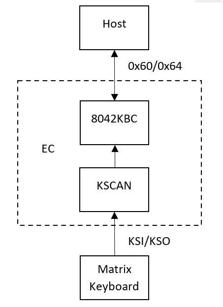
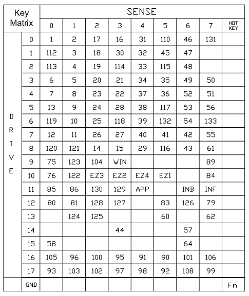
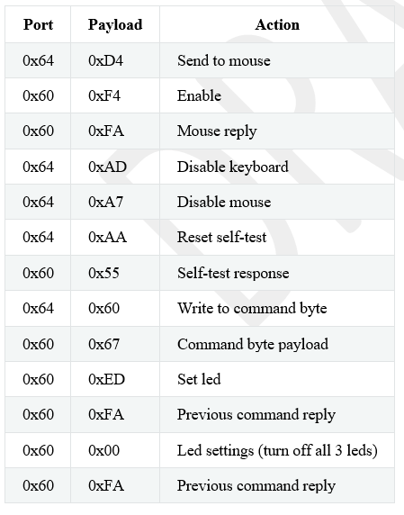
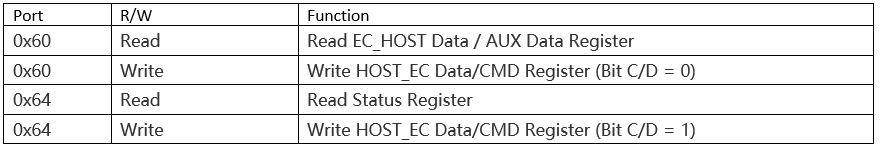
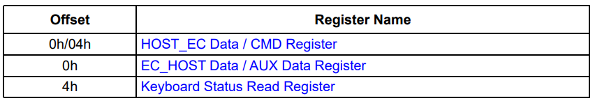
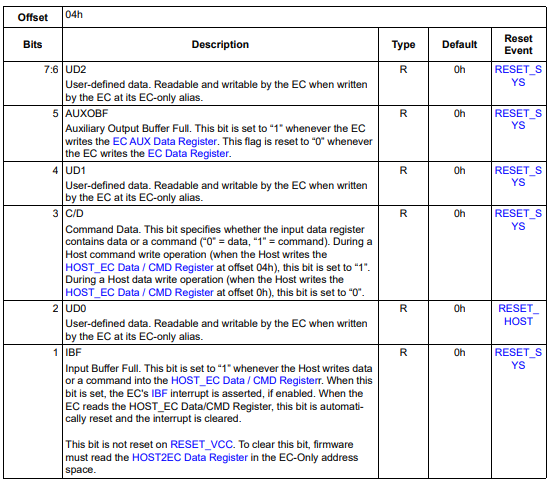
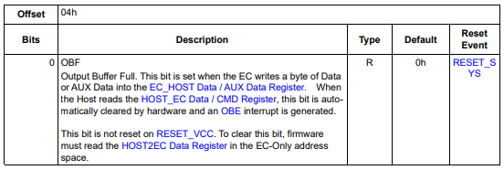
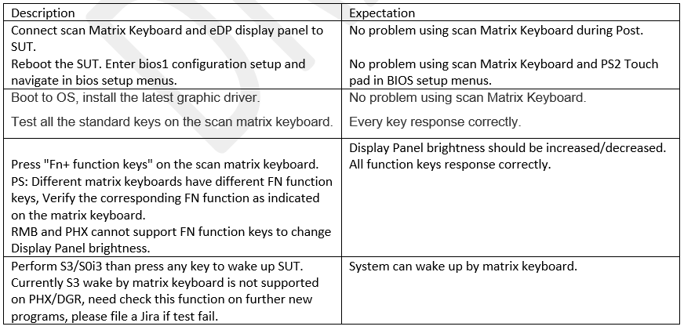

.. _kbc:

KBC
***************

Initially, the EC was conceived as a Keyboard System Controller (KSC), 
and its purpose was to realize the 8042 spec from IBM 8042 IBM design guide. 
The core function of keyboard controllers was to inform the CPU when a key was pressed or released. 
They also managed auxiliary devices such as a mouse. However, the KSC kept evolving to the point where it handles more responsibilities than just PS/2 devices. 
Therefore, today every 8042 command/behavior became a subset of the Embedded Controller chip. 
In modern PC systems, the EC can receive 8042 commands from either BIOS or the PS/2 windows driver.

Definitions
================================
- X86 - Main processors executing the x86 Instruction Set Architecture
- EC- Embedded Controller
- 8042 KBC - 8042 EMULATED KEYBOARD CONTROLLER
- KSCAN - KEYBOARD SCAN INTERFACE

Document Reference
================================
- Datasheet
- 8042 Keyboard Controller (From IBM Technical Reference Manual) http://64bitos.tistory.com/attachment/cfile29.uf@02784B4D50F966F12C3160.pdf

Feature Description
================================
KSCAN driver can get row and column data when user press or release one key. 
Row and column data will be translated to a specific key number through keymap. 
The key number then will be sent to host through port 0x60. 
Below is a matrix keyboard keymap.

Host can send commands and data to 8042KBC through port 0x60/0x64. 
And 8042KBC can ack data to host through 0x60. 
Below is an example of an 8042KBC command sequence needed to initialize 
the keyboard in BIOS context.

Communication between EC 8042 module and host through port60/64 is hardware behaviour. 
EC firmware will use below register to program. Host can also access register through 
port 0x60/0x64.

- For example, IBF(Keyboard Status Read Register bit 1) set to “1” 
whenever the Host writes data or a command into the HOST_EC Data / CMD Register. 
When this bit is set, the EC's IBF interrupt is asserted, if enabled. 
When the EC reads the Data/CMD Register, this bit is automatically reset and the 
interrupt is cleared. 
- When EC send data to host, firmware needs to write a byte of data into the EC_HOST Data / AUX Data Register. 
OBF(Keyboard Status Read Register bit 0) will be set and automatically cleared by hardware when host read the data.

Feature Implementation Details
================================
KSCAN Add customized keymap for specific matrix keyboard. 
Different keyboards have different map. Below is the keymap AMD CRB used.

.. code-block:: c

   static const uint8_t amdcrb_keymap[MAX_MTX_KEY_COLS][MAX_MTX_KEY_ROWS] = {
      {KM_RSVD, KM_RSVD, KM_RSVD, KM_RSVD, 125U, KM_RSVD, KM_RSVD, KM_RSVD},
      {KM_RSVD, 127U, KM_RSVD, KM_RSVD, KM_RSVD, KM_RSVD, KM_RSVD, KM_RSVD},
      {131U, KM_RSVD, 255U, 16U, 1U, 2U, 17U, 31U},
      {62U, 60U, KM_RSVD, KM_RSVD, KM_RSVD, KM_RSVD, KM_RSVD, KM_RSVD},
      {48U, 61U, 114U, 115U, 30U, 4U, 19U, 33U},
      {47U, 46U, 113U, 112U, 110U, 3U, 18U, 32U},
      {49U, 50U, 35U, 21U, 6U, 5U, 20U, 34U},
      {52U, 51U, 36U, 22U, 7U, 8U, 23U, 37U},
      {54U, 84U, 0U, 122U, 121U, 10U, 25U, 39U},
      {57U, 44U, KM_RSVD, KM_RSVD, KM_RSVD, KM_RSVD, KM_RSVD, KM_RSVD},
      {53U, 76U, 118U, 117U, 116U, 9U, 24U, 38U},
      {133U, 132U, 119U, 120U, 56U, KM_RSVD, 129U, 79U},
      {KM_RSVD, 58U, KM_RSVD, KM_RSVD, 64U , KM_RSVD, KM_RSVD, KM_RSVD},
      {55U, 83U, 12U, 123U, 11U, 26U, 27U, 40U},
      {41U, 43U, 126U, 90U, 13U, 15U, 28U, 29U},
      {81U, 89U, 14U, 124U, 76U, 80U, 85U, 86U},
   };

In some AMD projects. Hardware didn't connect the kso to chip's kso(kso can't use kscan state machine to drive). 
So must set CONFIG_GPIO_KSO_DRIVE=y and add gpio config in device tree to use gpio drive to replace the state machine.

.. code-block:: makefile

   #EC KEYBOARD AND PS2 DEVICE
   #---------------------
   CONFIG_KSCAN=y
   CONFIG_KSCAN_EC=y
   CONFIG_EC_AMDCRB_KEYBOARD=y
   CONFIG_GPIO_KSO_DRIVE=y
   CONFIG_PS2=n
   CONFIG_PS2_KEYBOARD=n
   CONFIG_PS2_MOUSE=n

.. code-block:: dts

   /* SMSC_KSO_0 */
   &kso00_gpio040 {
      pinmux = < MCHP_XEC_PINMUX(040, MCHP_GPIO) >;
   };

   /* SMSC_KSO_1 */
   &kso13_gpio126 {
      pinmux = < MCHP_XEC_PINMUX(0126, MCHP_GPIO) >;
   };

   /* SMSC_KSO_2 */
   &led3_gpio035 {
      pinmux = < MCHP_XEC_PINMUX(035, MCHP_GPIO) >;
   };

   /* SMSC_KSO_3 */
   &ps2_dat0a_gpio115 {
      pinmux = < MCHP_XEC_PINMUX(0115, MCHP_GPIO) >;
   };

   /* SMSC_KSO_4 */
   &kso04_gpio107 {
      pinmux = < MCHP_XEC_PINMUX(0107, MCHP_GPIO) >;
   };

   /* SMSC_KSO_5 */
   &kso05_gpio112 {
      pinmux = < MCHP_XEC_PINMUX(0112, MCHP_GPIO) >;
   };

   /* SMSC_KSO_6 */
   &kso06_gpio113 {
      pinmux = < MCHP_XEC_PINMUX(0113, MCHP_GPIO) >;
   };

   /* SMSC_KSO_7 */
   &kso07_gpio120 {
      pinmux = < MCHP_XEC_PINMUX(0120, MCHP_GPIO) >;
   };

   /* SMSC_KSO_8 */
   &ps2_clk0a_gpio114 {
      pinmux = < MCHP_XEC_PINMUX(0114, MCHP_GPIO) >;
   };

   /* SMSC_KSO_9 */
   &slp_s0_n_gpio064 {
      pinmux = < MCHP_XEC_PINMUX(064, MCHP_GPIO) >;
   };

   /* SMSC_KSO_10 */
   &kso14_gpio152 {
      pinmux = < MCHP_XEC_PINMUX(0152, MCHP_GPIO) >;
   };

   /* SMSC_KSO_11 */
   &ict10_gpio015 {
      pinmux = < MCHP_XEC_PINMUX(015, MCHP_GPIO) >;
   };

   /* SMSC_KSO_12 */
   &prochot_in_n_alt_gpio222 {
      pinmux = < MCHP_XEC_PINMUX(0222, MCHP_GPIO) >;
   };

   /* SMSC_KSO_13 */
   &kso17_gpio140 {
      pinmux = < MCHP_XEC_PINMUX(0140, MCHP_GPIO) >;
   };

   /* SMSC_KSO_14 */
   &kso16_gpio132 {
      pinmux = < MCHP_XEC_PINMUX(0132, MCHP_GPIO) >;
   };

   /* SMSC_KSO_15 */
   &kso15_gpio151 {
      pinmux = < MCHP_XEC_PINMUX(0151, MCHP_GPIO) >;
   };

   &kscan0 {
      status = "okay";

      pinctrl-0 = < &ksi0_gpio017
               &ksi1_gpio020
               &ksi2_gpio021
               &ksi3_gpio026
               &ksi4_gpio027
               &ksi5_gpio030
               &ksi6_gpio031
               &ksi7_gpio032
               &kso00_gpio040
               &kso13_gpio126
               &led3_gpio035
               &ps2_dat0a_gpio115
               &kso04_gpio107
               &kso05_gpio112
               &kso06_gpio113
               &kso07_gpio120
               &ps2_clk0a_gpio114
               &slp_s0_n_gpio064
               &kso14_gpio152
               &ict10_gpio015
               &prochot_in_n_alt_gpio222
               &kso17_gpio140
               &kso16_gpio132
               &kso15_gpio151 >;
      pinctrl-names = "default";
   };

Before use kbc module. Must set kbc base address and enable kbc module firstly.

.. code-block:: c

   #define ESPI_XEC_KBC_BAR_ADDRESS    0x00600000
      kbc_hw->KBC_CTRL |= MCHP_KBC_CTRL_AUXH;
      kbc_hw->KBC_CTRL |= MCHP_KBC_CTRL_OBFEN;
      /* This is the activate register, but the HAL has a funny name */
      kbc_hw->KBC_PORT92_EN = MCHP_KBC_PORT92_EN;
      regs->IOHBAR[IOB_KBC] = ESPI_XEC_KBC_BAR_ADDRESS |
                  MCHP_ESPI_IO_BAR_HOST_VALID;

Make sure 8042KBC and port 0x60/0x64 is active. 
The host will send configuration command to 8042KBC. 
Add scan code can be sent to host. You can check if the upstream/downstream is available in KBC thread. Below is KBC 0x64 commands.

.. code-block:: c

   /* port 0x64 keyboard controller commands.
   * Note : This commands are processed by the emulated keyboard controller
   */
   #define KBC_8042_READ_CMD_BYTE          (0x20U)
   /* expect a byte on port 0x60 */
   #define KBC_8042_WRITE_CMD_BYTE         (0x60U)
   #define KBC_8042_TEST_PASSWORD          (0xa4U)
   #define KBC_8042_DIS_MOUSE              (0xa7U)
   #define KBC_8042_ENA_MOUSE              (0xa8U)
   #define KBC_8042_TEST_MOUSE             (0xa9U)
   #define KBC_8042_RESET_SELF_TEST        (0xaaU)
   #define KBC_8042_TEST_KB_PORT           (0xabU)
   #define KBC_8042_DIAGNOSTIC_DUMP        (0xacU)
   #define KBC_8042_DIS_KB                 (0xadU)
   #define KBC_8042_ENA_KB                 (0xaeU)
   #define KBC_8042_READ_INPUT_PORT        (0xe0U)
   #define KBC_8042_INS_HOTKEY_EVENT       (0xc3U)
   #define KBC_8042_READ_OUTPUT_PORT       (0xd0U)
   #define KBC_8042_WRITE_OUTPUT_PORT      (0xd1U)
   #define KBC_8042_WRITE_KBD_OUTPUT_REG   (0xd2U)
   /* expect a byte on port 0x60 */
   #define KBC_8042_ECHO_MOUSE             (0xd3U)
   /* expect a byte on port 0x60 */
   #define KBC_8042_SEND_TO_MOUSE          (0xd4U)
   /* CPU reset through ESPI VW*/
   #define KBC_8042_PULSE_OUTPUT           (0xfeU)

Some command should send KBC_8042_WRITE_CMD_BYTE(0x60) to port 0x64 firstly. Then send the following command through port 0x60.

.. code-block:: c

   /* port 0x60 keyboard commands */
   #define KBC_8042_ECHO_KEYBOARD          (0xeeU)
   #define KBC_8042_SET_LEDS               (0xedU)
   #define KBC_8042_SET_GET_SCANCODE       (0xf0U)
   #define KBC_8042_READ_ID                (0xf2U)
   #define KBC_8042_SET_TYPEMATIC_RATE     (0xf3U)
   #define KBC_8042_EN_KEYBOARD            (0xf4U)
   #define KBC_8042_DEFAULT_DIS            (0xf5U)
   #define KBC_8042_SET_DEFAULT            (0xf6U)
   #define KBC_8042_RESEND                 (0xfeU)
   #define KBC_8042_RESET                  (0xffU)

Flags for the "command byte" which is located in address 0x20 in ancient KBCs. 
In the EC case we use a simmple variable for book-keeping.

.. code-block:: c

   #define KBC_8042_EN_KBD_IRQ             (1 << 0)
   #define KBC_8042_EN_MOUSE_IRQ           (1 << 1)
   #define KBC_8042_HOST_SYS_FLAG          (1 << 2)
   #define KBC_8042_KBD_DIS                (1 << 4)
   #define KBC_8042_MOUSE_DIS              (1 << 5)
   #define KBC_8042_TRANSLATE              (1 << 6)

Below is the value KBC will return to host.

.. code-block:: c

   #define KBC_8042_ACK                    (0xfaU)
   #define KBC_8042_NACK                   (0xfeU)
   #define KBC_8042_BAT                    (0xaaU)
   #define KBC_8042_MOUSE_ID               (0U)

Keyboard needs to support modern standby wakeup. 
It will be triggered when key has been pressed. 
EC will pull sci pin and send one sci code.

.. code-block:: c

                     if (g_ui8MondernStandbySupport &&
                           app_pseq_systemState() == SYSTEM_S3_STATE) {
   #ifdef CONFIG_SLEEP
                           board_slp_wake_up_from_kb();
   #endif
                     }

Feature Firmware Domain Interactions
================================
SBIOS to EC to exchange command and data. It commonly uses ESPI message and port 0x64/0x60.

Firmware Interface
================================
SBIOS to EC 8042KBC interface.

Feature Risk
================================
High

Feature Verification Environment
================================
AMD CRB with matrix keyboard

Feature Verification Test Plan details 
================================
http://atm/atm/#/TestCases/2685551

Feature Verification Unit Test Plan
================================

Dependencies
================================
Matrix keyboard.