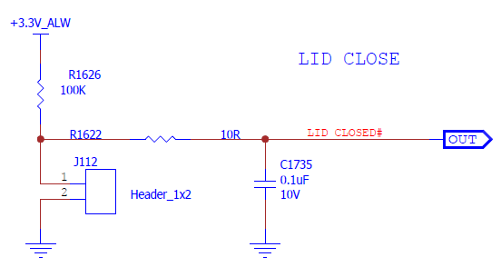
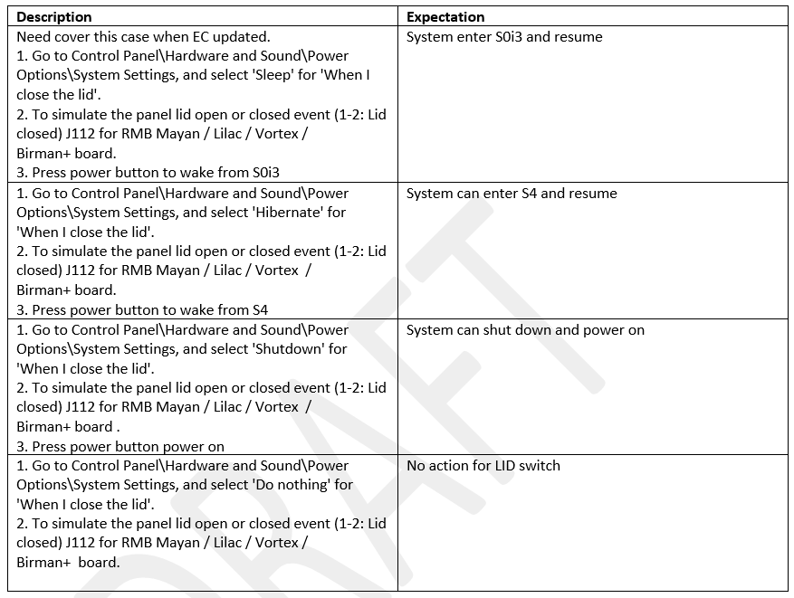

.. _lid:

Lid Device
***************

- The Lid device presents one element of a complete system for your laptop with Lid closed or opened. Newer laptops use magnets and hall effect sensors to detect every time the display is closed. The sensor typically get engaged when the lid is closed, turning off the internal LCD. The sensor(system) then moves the display output to the external monitor if present or puts the laptop to sleep or hibernation.
- The older laptops used mechanical switches which placed near the hinges or the top of the display. Once the lid closes,
the controller would signal the operating system to initiate the configured power setting, whether sleep, hibernate, shut down or do nothing.
- AMD CRB also uses mechanical switch to simulate lid closed or opened.

Definitions
================================
-  x86 - Main processors executing the x86 Instruction Set Architecture
-  PMFW - System Management firmware responsible for Power Management
-  PMFW - System Management Unit processor that executes PMFW
-  PSP - Platform Security Processor
-  PSP FW - Security firmware executed by the PSP
-  FCH - Fusion Controller Hub
-  SOC - System On Chip
-  DF - Data Fabric 
-  CCX - Core complex
-  AGESA - AMD Generic Encapsulated Software Architecture is AMD reference code resistible for initializing the AMD SOC
-  DXIO - Interconnect firmware responsible for initializing interconnect links (e.g PCIe)
-  MP2 - Microprocessor that executes the sensor firmware
-  MP2 FW - This is the firmware executed on the MP2 to program the sensor fusion controller
-  ABL - AGESA BootLoader - AGESA SOC initialization code executed by the PSP
-  UMC - Unified Memory Controller responsible for routing data to and from the system memory
-  DDR - Double Data Rate channel to access the system memory
-  DDR Phy - responsible for controlling the signaling on the DDR channel
-  MEM - AGESA firmware responsible for programming the UMC and DDR Phy
-  PMU - Phy Microcontroller Unit - responsible for training the DDR channel
-  OSPM - OS-directed configuration and power management

Document Reference
================================
- Advanced Configuration and Power Interface (ACPI) Specification Version 6.3

Feature Description
================================
From HW design, the Lid switch is connected to EC, when Lid status has changed, 
EC will know and trigger a Q event to notify ACPI driver.

Feature Execution Flow
================================
- Lid status change
- EC receive and send Q event
- In the “_Qxx” method, it will notify LID device to update the LID status for OS 

Feature Implementation Details
================================
- When Lid status has changed, EC will trigger an interrupt.

- EC interrupt handler

   - Store Q event number indicating the cause of the notification.
   - set SCI_EVT (bit5) flag indicating SCI event is pending in EC status register.
   - Generate an SCI to OSPM. 

   AMD CRB uses physical SCI signal rather than VW_SCI# to notify system for AMD APU could not support Espi when system in S0i3 or S4/S5 state.

   Embedded Controller Status, EC_SC(R)

   This is a read-only register that indicates the current status of the embedded controller interface.

   .. figure:: EC_SC.png
      :width: 400px
      :name: EC_SC.png

- OSPM detects the embedded controller SCI, sees the SCI_EVT flag set, and sends query command (0x84) to EC.

   .. figure:: EC_CMD.png
      :width: 600px
      :name: EC_CMD.png

- Upon receipt of the QR_EC (0x84) command byte, EC places Q event number in EC_EC2OS_DATA, 
generates SCI to OSPM for OBF=1.

- The Q event number indicates which interrupt handler operation should be executed by OSPM. 
In the “_Qxx” method, it will notify LID device to update the LID status for OS.

   .. figure:: lid_qevent.png
      :width: 400px
      :name: lid_qevent.png

Customer Impact
================================
- By default, your PC is put to sleep when you close the lid, which isn't ideal if you want your laptop out of sight while it's docked on your workspace. Here's how to change that setting.
- You can change this behavior in Windows 10 and Windows 11 from the Control Panel. The quickest way to do this is to open the Start menu and search "lid" and select the Choose what closing the lid does entry.

   .. figure:: power_options.PNG
      :width: 600px
      :name: power_options.PNG

   .. figure:: power_options2.PNG
      :width: 600px
      :name: power_options2

Feature Verification Test Plan details 
================================
http://atm/atm/#/TestCases/2744700

Feature Verification Unit Test Plan
================================

