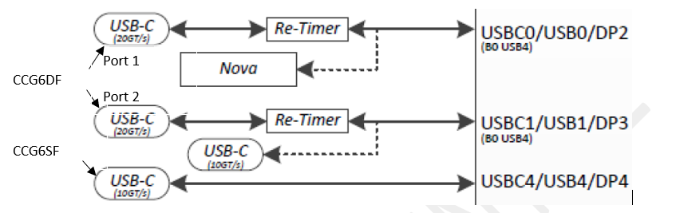

.. _pd:

Power Delivery over Type-c
***************

Definitions
================================
- x86 - Main processors executing the x85 Instruction Set Architecture
- PMFW - System Management firmware responsible for Power Management
- PMFW - System Management Unit processor that executes PMFW
- PSP - Platform Security Processor
- PSP FW - Security firmware executed by the PSP
- FCH - Fusion Controller Hub
- SOC - System On Chip
- DF - Data Fabric 
- CCX - Core complex
- AGESA - AMD Generic Encapsulated Software Architecture is AMD reference code resistible for initializing the AMD SOC
- DXIO - Interconnect firmware responsible for initializing interconnect links (e.g PCIe)
- MP2 - Microprocessor that executes the sensor firmware
- MP2 FW - This is the firmware executed on the MP2 to program the sensor fusion controller
- ABL - AGESA BootLoader - AGESA SOC initialization code executed by the PSP
- UMC - Unified Memory Controller responsible for routing data to and from the system memory
- DDR - Double Data Rate channel to access the system memory
- DDR Phy - responsible for controlling the signaling on the DDR channel
- MEM - AGESA firmware responsible for programming the UMC and DDR Phy
- PMU - Phy Microcontroller Unit - responsible for training the DDR channel

Document Reference
================================
- CCGx Host Processor Interface
- TPS6599xBF Host Interface Technical Reference Manual
- Universal Serial Bus Power Delivery Specification

Introduction
================================
PD controllers are responsible for USBC port controlling and APU crossbar programming. 
It needs to control both power and data in type-c USB port. 
For power, PD controller needs to handle with the source and sink power delivery. 
For data, it needs to handle with USB3/4, TBT, DP alt mode in type-c USB port. 
Below is the block diagram of AMD CRB design:

Normally, we have two PD controllers. 
One dual ports controller to control two USB4 ports (C20) and another one single port controller to control one USB3 port (C10).
Below is the basic requirement for the IFX PD controller:

a.	Provide the FWs requested.

b.	CCG6DF detects re-timer (none, PS8828A or PS8830) on board (drive P0.2 and P0.3 High, wait 5ms before detecting by I2C)

c.	Indicate FW SKU number to EC.

d.	Refer to Rembrandt (FP7R2/FP7R2r2) and Renoir (FP6) APU USB-C I2C programming guide.

e.	Refer to PS8828A and PS8830 register tables.

f.	Prevent external sources (3 ports) from contending powering system.

   - Inter ports contend managed by CCG6DF itself.
   - Inter ports contend managed by P2.4 and P2.3. P2.4 High indicates CCG6DF is powering system; P2.3 High indicates CCG6SF is powering system.
   - When EC is ready, EC manages the power sources (higher capacity source will power system).

Each PD controller has two I2C bus, one acts as I2C master to program APU crossbar based on the attached device. Another one acts as I2C slave and used to communicate with EC. There is no directly connection between Bios and PD. Below is the base requirement for EC to control PD:

a.	Report BIOS the re-timer model, PD FW version and FW SKU number that are gotten from PD controller.

b.	Update PD FWs once EC power on

   .. figure:: pd_fw.PNG
      :width: 400px
      :name: pd_fw

c.	Handle the power delivery based on PD report and program the charger correspondingly.

d.	Support TBT/USB4 feature enable/disable.

e.	Support type-c port enable/disable.

f.	Support hard reset PD controller chip.

g.	Update system status to PD controller.

h.	Handle the UCSI state machine and message tunneling.

i.	Response for the PD interrupt.

j.	Dynamic change Power Role and Data Role based on system status.

k.	Special workaround for PD controller in AMD CRB

Feature Description
================================
This feature describes how EC to handle with the PD controller to meet AMD CRB USBC requirement.

Firmware Requirements Document Reference
================================

Feature Execution Flow
================================
1. Report BIOS the re-timer model, PD FW version and FW SKU number that are gotten from PD controller.
EC needs to get the PD FW version, re-timer type and PD FW SKU number from PD controller FW. And resport those information to Bios.
Bios will show it in the PBS option -> AMD Firmware Version page:

   .. figure:: pd_fw_version.png
      :width: 400px
      :name: pd_fw_version

2.	Update PD FWs once EC power on.
PD firmware binaries are checked into Bios image. Below is the example for Bios layout related PD binaries.
In SBIOS, EC and PD (Power Delivery) FWs layout is as below,PD firmware layout is changed as we need to support more hardware combinations.

   .. figure:: fw_offset.png
      :width: 600px
      :name: fw_offset

EC is repsoible for detecting the the board type based on board id (for example what re-timer it supports). 
And upgrade the correct PD firmware to the PD controller, in case we need to support multiple hardware combinations.

   .. figure:: pd_fw_offset.png
      :width: 600px
      :name: pd_fw_offset

EC can know the PD binary location in Bios image from ECSig. Which means EC owner needs to adjust the ECSig based on the binaries.	

   .. figure:: pd_sig.png
      :width: 600px
      :name: pd_sig

3.	Handle the power delivery based on PD report and program the charger correspondingly.

   EC needs to know if there is device attached in the type-c port. If there is device attached, EC also needs to know its data role and power role. 

   If device act as sink, EC must know the PD contact (PDO) information. PDO includes the PD negotiation result with voltage and current. If the PDO cannot meet AMD CRB request, EC can shutdown the PD Sink path by “PD_SINK_OFF”. If PDO can meet CRB requirement, EC needs to config the PD charger IC with correspondingly setting.

   AC_Limit: PDO_Current + margin.

   AC_Prochot: PDO_Current + margin.

   EC also handles with the mulipe power source switch algorith:

   .. figure:: pd_algo.PNG
      :width: 600px
      :name: pd_algo

4.	Support TBT/USB4 feature enable/disable.

   EC needs to support TBT and USB4 feature enable/disable.

   IFX PD controller uses below register to enable or disable the TBT and USB4 mode. PD controller will auto send the data reset if EC change this reigser with device attached.

   .. figure:: pd_mode_register.jpg
      :width: 400px
      :name: pd_mode_register

   TI PD controller needs EC to overwrite register 0x47 to enable or disable TBT and USB4 mode.

      1.  USB4 mode (Register 0x47). 

      2.  Thunderbolt mode disabled (thunderBoltModeEnabled bit set to 0 in register 0x52). 

      3.  Automatic ID request (AutomaticIDRequest bit set to 0 in register 0x29) 

   Steps to enable USB4 mode after boot up:

      a. Let EC load unified firmware patch in the PD controller via I2C. 
      
      b. Once PD controller is in APP mode, EC enable the features (TBT/USB4) based on SKU. 
      
      c. If ConnState =< b'101 (bit 3:1 of register 0x1A), goto step 6. 
      
      d. If DataRole == b'0 (bit 6 of register 0x1A), goto step 6. (Note: Data role = UFP is not a valid case in Multifunction mode.) 
      
      e. Let EC execute 'AMDs' Task. 
      
      f. Enable Automatic ID request field in register 0x29 bit 16. 

      .. figure:: pd_cmd_flow.png
         :width: 400px
         :name: pd_cmd_flow

5.	Support type-c port enable/disable.

   To meet the Microsoft USBC security features, EC support USBC port enable and disable.

      .. figure:: typec_support.png
         :width: 400px
         :name: typec_support

      - For the Mode3, it is covered by EC command to disable and enable port to PD controller.
      - PD controller support four type-c state machine:
      - DRP-> Dual power/data role -> CC pin keeps toggling.
      - UFP-> Upstream port only -> CC pin keeps pull down by Rd resistor.
      - DFP-> Downstream port only -> CC pin keeps pull up by Rp resistor.
      - NA -> no mode support -> CC pin is in high-z.

      EC switchs the PD mode between active (DRP/UFP/DFP) mode and NA mode for enable and disable.

6.	Support hard reset PD controller chip.	

   EC supports command to reset PD controller in below cases:

   a.	When PD FW is upgraded done. Need to reset PD and reload new firmware.
   b.	Detect PD controller error and reset PD controller.

7.	Update system status to PD controller.

   EC needs to update system status G3/S5/S3/S0 status to PD controller for below purposes:

   a.	PD controller self power management.
   b.	PD know crossbar status in G3.

8.	Handle the UCSI state machine and message tunneling.

   UCSI is covered by Document “EC - USCI Device support Mini FAD”

9.	Response for the PD interrupt.

   Each PD controller has dedicated physical interrupt pin connected to EC. EC needs to serve the interrupt in firmware interrupt handler.

   When EC detects PD interrupt assert, it needs to figure out the interrupt source by checking PD register. For example, interrupt is triggered by device attach or detach, Power Role swap, Data Role swap or new contract.
   Based on the interrupt source, EC can check following regiser to update the latest status in USBC port. Those informations are important for other tasks.

   After EC serves the interrupt, it needs to set PD regitster to clear the interrupt.

   In the EC intilization, EC needs to set the right interrupt mask of PD controller, only unmasked interrupt source can trigger the physical interrupt. We only need to keep expected interrupt source based on requirement.

10. Dynamic change Power Role and Data Role based on system status.

   EC needs to dynamically trigger the power role swap or data role swap in below scenarios:

   a.	DRP phone attached in system G3:
   
   DRP phone can act as both source and sink role when connected to CRB. When system in G3, it is unable to provide VBUS as source, because VBUS is powered by 5V_ALW. In this case, EC will set the PD to UFP only. 
   When DRP phone attached or keeps attached, it will enter source mode to provide 5V VBUS to system. However, system cannot use 5V and will not sink any current.
   When system resume from G3 to S5, PD will keep established contract. But the expected status is CRB charge DRP phone. So, EC needs to identify this scenario by firmware, and assert the PR_SWAP to change the power role.

   b.	Some docks will not auto send the DR_SWAP when it acks as DFP.
   In this case, EC needs to send the DR_SWAP to swap CRB to DFP.

11. Special workaround for PD controller in AMD CRB

   a.	Dynamic change the unconstrained power bit based on system power supplier capability.
   b.	Dynamic adjust the PD controller source PDO between 5V/3A and 5V/1.5A.

Feature Firmware Domain Interactions
================================
I2C interace to interact with PD controller.

Firmware Interface
================================
I2C BUS and GPIO.

Firmware Dependency
================================
- SBIOS to EC firmware interface definition
- ESPI EC support on platform
- EC depends on eSPI bus being initialized prior to use
- ESPI initialization sequence documented in PPR
- CPM to SBIOS interface in UEFI definition
- DSDT/SSDT ACPI tables for EC definition
- MMIO/IO APCB token decode ranges definition
- APCB binary with MMIO/IO tokens
- EC FW binary

Feature Verification Environment
================================
- Check USBC funcions with different devices.
- Verify USBC functions with compliance tester.

Feature Verification Test Plan details 
================================
- Power Deliver compliance test
- Type-c compliance test
- USBC functional test
- Display functional test

Feature Test Plan Types
================================
- Unit
- Integration
- Test Vehicle (TV) board