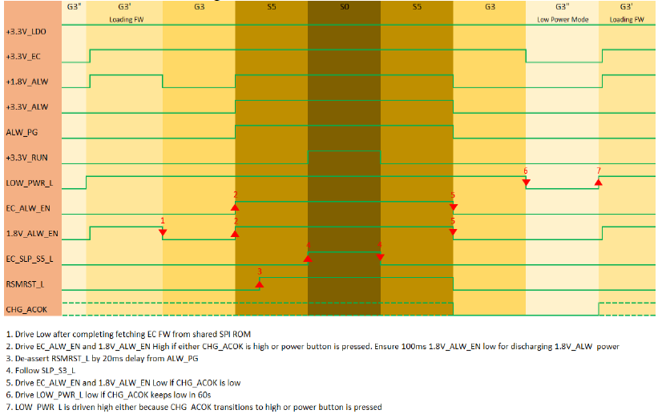

.. _powersequence:

Motherboard power sequence
***************

Definitions
================================
- x86 - Main processors executing the x86 Instruction Set Architecture
- PMFW - System Management firmware responsible for Power Management
- PMFW - System Management Unit processor that executes PMFW
- PSP - Platform Security Processor
- PSP FW - Security firmware executed by the PSP
- FCH - Fusion Controller Hub
- SOC - System On Chip
- DF - Data Fabric 
- CCX - Core complex
- AGESA - AMD Generic Encapsulated Software Architecture is AMD reference code resistible for initializing the AMD SOC
- DXIO - Interconnect firmware responsible for initializing interconnect links (e.g PCIe)
- MP2 - Microprocessor that executes the sensor firmware
- MP2 FW - This is the firmware executed on the MP2 to program the sensor fusion controller
- ABL - AGESA BootLoader - AGESA SOC initialization code executed by the PSP
- UMC - Unified Memory Controller responsible for routing data to and from the system memory
- DDR - Double Data Rate channel to access the system memory
- DDR Phy - responsible for controlling the signaling on the DDR channel
- MEM - AGESA firmware responsible for programming the UMC and DDR Phy
- PMU - Phy Microcontroller Unit - responsible for training the DDR channel
- Connector - A USB Type-C connector that is attached to the platform
- LPM - Local Policy Manager. Hardware/Firmware that manages an individual USB Type-C connector.
- OPM - OS Policy Manager. Operating Software that interfaces with the PPM
- PPM - Platform Policy Manager. Hardware/Firmware that manages all the USB Type-C connectors on the platform.

Document Reference
================================
- Add any references that will help to understand the content of this document:
- AMD CRB schematic.
- 56983: Platform EC Module Interface Specification for Famil 19h Modules 70-77h

Introduction
================================
- Power sequence control is one of the EC features. It is critical for the board to power up properly. Figure below defines the power up and power down sequence. It shows how EC needs to handle with power rail and APU critical signals and they need to follow sensitive timing to make sure APU can work in expected status. Any mismatching may cause potential risk and wrong status for APU.
- EC also needs to follow the sequence especially when system status change. For example, from G3 to S5, from S5 to S0.

Feature Description
================================
This feature describes how EC to handle with the APU power sequence to meet APU power sequence requirement for different status transition.

Firmware Requirements Document Reference

Feature Execution Flow
================================
1.	Power Domians:
   
   Below power domains are controlled or related to EC. 
   
   - 3.3V_LDO is generated by the low capability LDO convertor which converts the charger output 13V to 3.3V. And it can only provide very limited power 100mA. It is used as power supplier when system work in battery low power mode (VCI). In VCI mode, only small parts of EC would be alive to detect GPIO event for example, AC plugin or power button click.
   - 3.3V_EC is generated by the main 3.3V regulator which changes charger output 13V to 3.3V. It has higher capability than 3.3V_LDO. It acts as main power source for EC and PD. Some I2C devices also work in this power rail. 3.3V_EC should be the first power domin ready after system power on. EC will auto load firmware from Bios ROM after this power rail ready.
   - 1.8V_ALW is generated by the 5S power domin to supply all the 1.8V related S5 circuit. This power should be ready when system enters S5.
   - 3.3V_ALW is generated by the 5S power domin to supply all the 3.3V related S5 circuit. This power should be ready when system enters S5.
   - 3.3V_RUN is generated by S0 power domin to supply all the 3.3V related S0 circuit. This power should be ready when system enters S0.

   .. figure:: power_domain1.png
      :width: 600px
      :name: power_domain1

   Power supply relationships during power-up, power-down, and entry and exit of any power
   management state must be controlled in order to ensure proper operation of the device. Power
   supplies are arranged into power sequencing groups as shown below tables. There are no sequencing requirements between power supplies in the same power sequencing group unless specifically noted.

   .. figure:: power_domain2.png
      :width: 600px
      :name: power_domain2

   .. figure:: power_domain3.png
      :width: 600px
      :name: power_domain3

2.	Power good requirement:

   - All power supplies in all Power Sequencing Groups must be stable and within specification one
   ms before the assertion of PWR_GOOD.
   - PWR_GOOD must be deasserted when any supply in any power group is out of specification,
   uncontrolled power-down or power failure.
   - Refer to the FP8 Infrastructure Roadmap (NDA), order# 57266, for power supply specifications.

3.	Power up sequence requirements:

   - All power supplies in Power Sequencing Group A must be stable and within specification before
   any power supply in Power Sequencing Group B is greater than 10 percent of its specified typical
   operating value.
   - All power supplies in Power Sequencing Group B must be stable and within specification before
   any power supply in Power Sequencing Group C is greater than 10 percent of its specified typical
   operating value.
   - If using group definitions from Table 26 all power supplies in Power Sequencing Group C must
   be stable and within specification before any power supply in Power Sequencing Group D is
   greater than 10 percent of its specified typical operating value.
   - All power supplies in Power Sequencing Group C or Power Sequencing Group
   D must be stable and within specification one ms before the assertion of PWR_GOOD.
   - Firmware control is required to control the operating voltage of VDDCR_SOC.

4.	Power Down and Power Failure Power sequence requirements:

   No sequencing relationships are required between the power sequencing groups during an
   uncontrolled power-down or power failure.

5.	Signal Sequence:

   - If the JTAG interface is used in a system, the TMS pin must be asserted a minimum of 10 ns
   before PWR_GOOD assertion and must be held in the high state a minimum of 10 ns after the
   assertion of PWR_GOOD.
   - After PWR_GOOD assertion, the SVC/SVD signals change from the Boot VID to the value
   programmed during device manufacturing and the appropriate protocol for the SVI interface.
   - RESET_L must remain asserted a minimum of 1 ms after PWR_GOOD assertion.

   .. figure:: signal_sequence1.png
      :width: 600px
      :name: signal_sequence1
 
   .. figure:: signal_sequence2.png
      :width: 600px
      :name: signal_sequence2
 
   .. figure:: signal_sequence3.png
      :width: 600px
      :name: signal_sequence3
 
   .. figure:: signal_sequence4.png
      :width: 600px
      :name: signal_sequence4
 
   .. figure:: signal_sequence5.png
      :width: 600px
      :name: signal_sequence5

   .. figure:: signal_sequence6.png
      :width: 600px
      :name: signal_sequence6
 
   .. figure:: signal_sequence7.png
      :width: 600px
      :name: signal_sequence7

6. EC sample code:

   .. figure:: sample_code1.png
      :width: 600px
      :name: sample_code1

   .. figure:: sample_code2.png
      :width: 600px
      :name: sample_code2

   .. figure:: sample_code3.png
      :width: 600px
      :name: sample_code3

   .. figure:: sample_code4.png
      :width: 600px
      :name: sample_code4

   .. figure:: sample_code5.png
      :width: 600px
      :name: sample_code5

   .. figure:: sample_code6.png
      :width: 600px
      :name: sample_code6

Feature Firmware Domain Interactions
================================
Support APU power sequence

Firmware Interface
================================
GPIO and hardware circuit.

Customer Impact
================================
Customers need to follow same power sequence with AMD APU.

Firmware Dependency
================================
- SBIOS to EC firmware interface definition
- ESPI EC support on platform
- EC depends on eSPI bus being initialized prior to use
- ESPI initialization sequence documented in PPR
- CPM to SBIOS interface in UEFI definition
- DSDT/SSDT ACPI tables for EC definition
- MMIO/IO APCB token decode ranges definition
- APCB binary with MMIO/IO tokens
- EC FW binary

Feature Verification Environment
================================
- Check USBC funcions with different devices.
- Verify USBC functions with compliance tester.

Feature Verification Test Plan details 
================================
- Use scope to measure the power sequence with different status transition.

- ACPI test:

   - S0 to S0i3 long run 100 cycle
   - S0 to S4 long run 100 cycle
   - S0 to S5 long run 100 cycle
   - S0 to G3 long run 100 cycle 

Feature Test Plan Types
================================
- Unit
- Integration
- Test Vehicle (TV) board