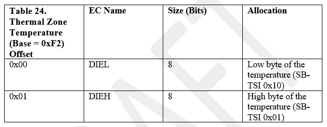
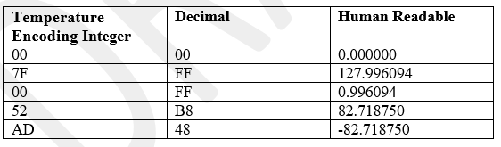
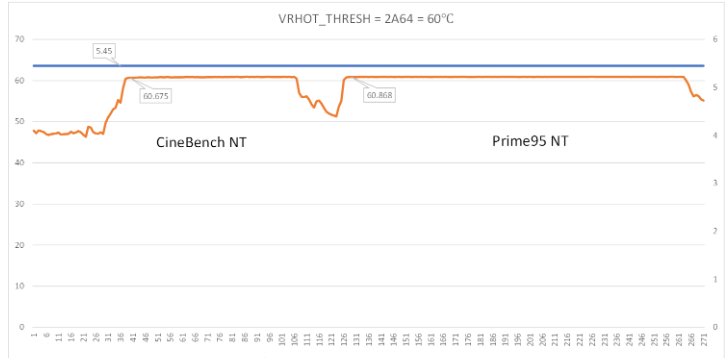
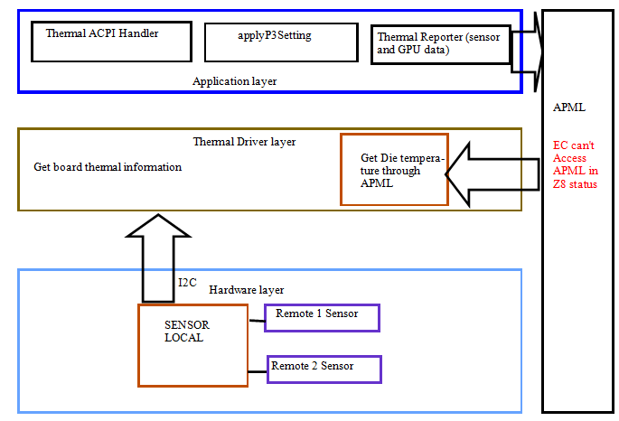
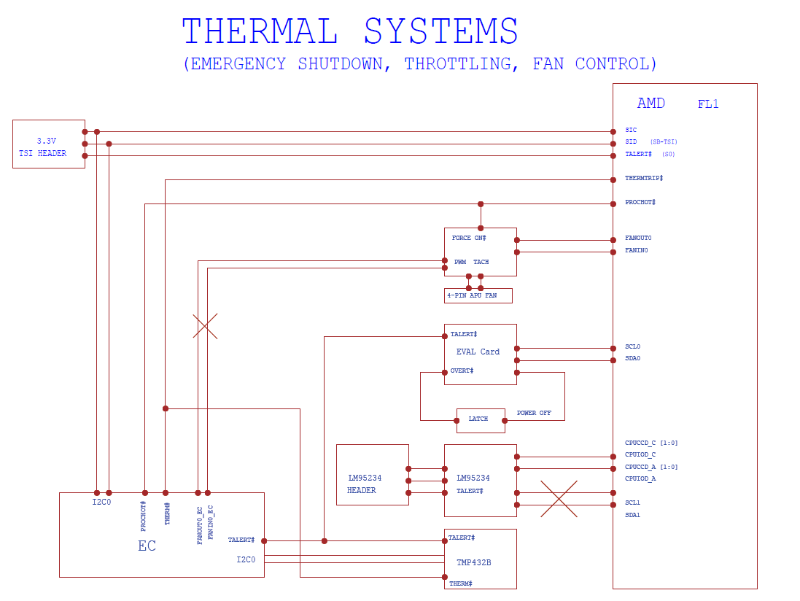
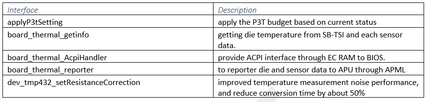
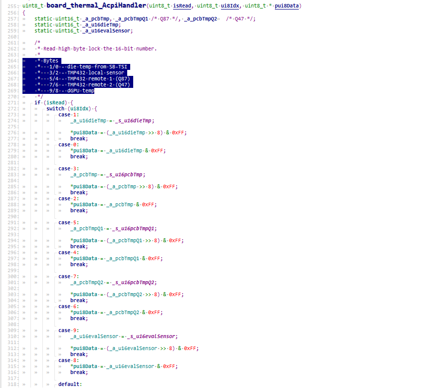
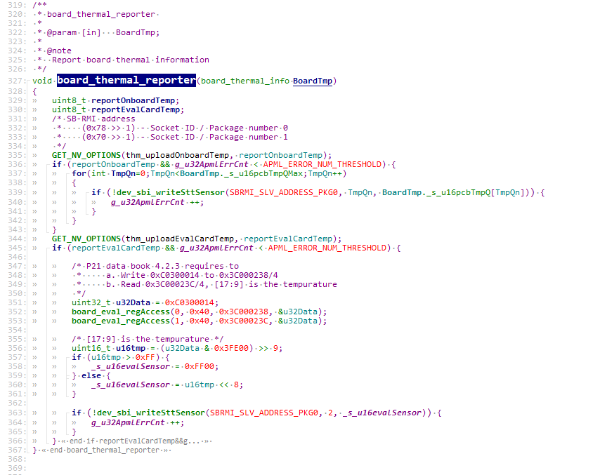
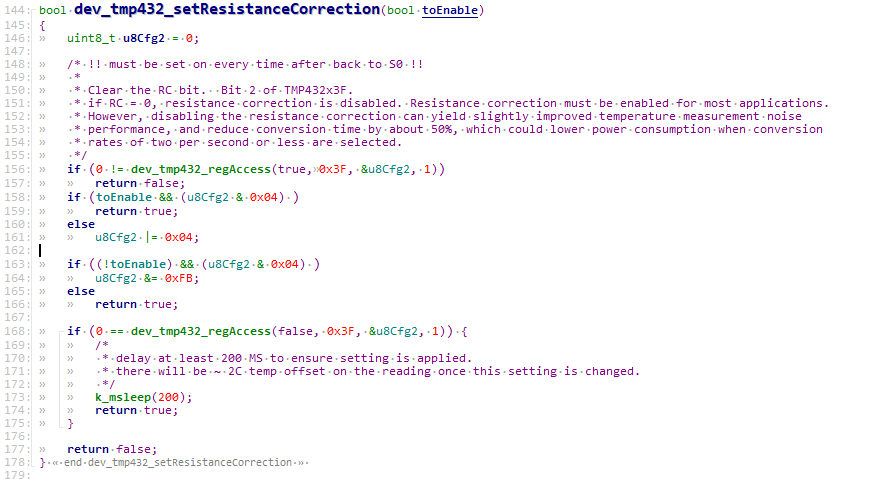

.. _stt:

Skin temperature tracking 
***************

Definitions
================================
- x86 - Main processors executing the x86 Instruction Set Architecture
- PSP - Platform Security Processor
- CCX - Core complex

Document Reference
================================
- AMD System Peripheral Bus Overview, order# 55861 
- AMD Platform Security Processor BIOS Architecture Design Guide for AMD Family 17h and Family 19h Processors (BIOS Developers Guide), order# 55758 
- https://devhub.amd.com//wp-content/uploads/Docs/56102_0.90.pdf 
- Advanced Configuration and Power Interface (ACPI) Specification (ACPI Specification) 
- https://uefi.org/specifications 

Introduction
================================
- The BIOS exports a thermal device as defined by the ACPI Specification, Section 11.4, 
Thermal Objects, where the _TMP method reports the current temperature to the OS by reading EC space offset 0xF2 and 0xF3. 
EC fills this field with the filtered die temperature reading from AMD SB-TSI. 

- From EC perspective, thermal is one of the tasks keep running 
after system enter S0 and APU boot up SMU ready happen, and the key responsibility is getting each sensor. 

BIOS reads the high byte first so EC shall lock the whole word for atomic read when the high byte is read. 
This field is 16-bit length with 8 fractional bits. T
he valid range is from -128.0 to 127.99609375. 
Examples of the encoding are shown in Table 25.

.. note:: 

   The BIOS reports the _CRT value at 110℃. 
   If the data reported by this field is greater than that value, the system will shut down. 
   EC should not report the raw data read from SB-TSI since it can bounce very quick. 
   Alternatively, EC can apply an alpha filter. 
   
   𝐹𝑖𝑙𝑡𝑒𝑟𝑒𝑑𝑉𝑎𝑙𝑢𝑒 = 𝐹𝑖𝑙𝑡𝑒𝑟𝑒𝑑𝑉𝑎𝑙𝑢𝑒 × (1.0 − 𝛼) + 𝑅𝑎𝑤𝐷𝑎𝑡𝑎 × 𝛼 

The EC reports temperature properly to avoid unexpected shutdown from Windows 
and ensure the balance between temperature and power consumption.

Architecture
================================
EC has the responsibility of getting die temperature from SB-TSI 
and each sensor (based on Hardware it could be TMP431 TPM432 or TPM468) data 
through I2C and loop to reporter GPU and sensor data to APU through APML, 
EC also provide ACPI interface through EC RAM to SMU, and manage P3Setting 
included applying the P3T budget and updating the P3T budget.

Feature Description
================================

1.	board_thermal_AcpiHandler

   EC provide ACPI interface through EC RAM to SMU

2.	board_thermal_reporter

   This feature is mainly to routes the collected board sensor temperature GPU temperature to the APU through APML.

3.	dev_tmp432_setResistanceCorrection

Initial Feature Program
================================
Mandolin was the first Program support this feature.

Firmware Requirements Document Reference
================================
Platform EC Module Interface Specification https://devhub.amd.com/search/56983/

Feature Execution Flow
================================

   .. figure:: thermal_flow.png
      :width: 400px
      :name: thermal_flow

Feature Verification Test Plan details 
================================
https://confluence.amd.com/display/SRDCV/Skin+Temperature+Testing

Step-by-step guide

Enable EC logs to dump sensor and die data, Steps to run XGMI Temperature Gradient Test

   1.	Set the temperature chamber to the desired setting (0C or 45C).
   2.	Run a stressful graphics app (ex. FurMark) are max settings for 30min to soak ASIC before activating the XGMI link.
   3.	Now close the stress graphics app and activate the XGMI link by running a P2P transfer app (ex. Quark)
 
Steps to run XGMI Ramp Temperature Test

   1.	Set the temperature chamber to ROOM temperature (25C)
   2.	Activate the XGMI link by running a P2P transfer app (ex. Quark).
   3.	Change the temperature chamber to the desired setting (0C or 45C) and let the P2P transfer app continue running.

Pass/Fail criteria.

   - There should be no failure during link training while GPUs have temperature Gradient.

   - There should be no workload failure or corruption.

   - System is stable with

      - no application hangs.
      - no XGMI PCS errors
      - No system hang.
      - System does not reboot or power off
      - System is not slow or unresponsive
